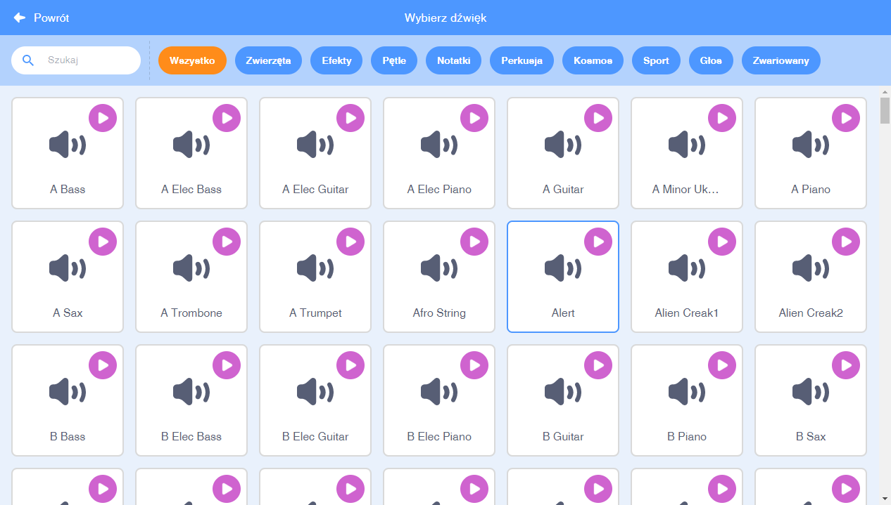
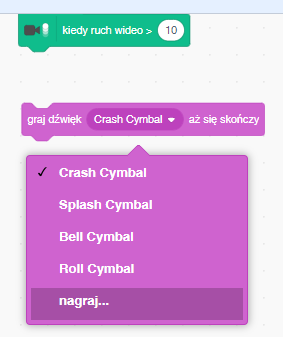

## Wyzwanie: ulepsz swój zespół muzyczny

Wykorzystaj to, czego nauczyłeś się w tym projekcie, aby stworzyć własny zespół! Możesz tworzyć dowolne instrumenty - popatrz na dostępne dźwięki oraz duszki instrumentów, żeby się zainspirować.



```blocks3
when this sprite clicked
set instrument to ((1) Pianino v)
play note (60) for (0.25) beats
```

Twoje instrumenty nie muszą być realistyczne. Możesz na przykład stworzyć pianino z babeczek!


Możesz używać więcej duszków z biblioteki, a także możesz malować własne duszki!


--- collapse ---
---
title: Dlaczego mój duszek „podskakuje”, kiedy zmienia kostium?
---

Podczas tworzenia własnego duszka może się okazać, że po kliknięciu duszek „podskakuje”, gdy zmienia kostium. Dzieje się tak, ponieważ dwa kostiumy nie są wyśrodkowane w tym samym miejscu.

Aby to naprawić, upewnij się, że środki kostiumów duszka są takie same.

--- /collapse ---

Jeśli masz mikrofon, możesz nagrywać własne dźwięki, a nawet użyć kamery internetowej, aby uderzać w swoje instrumenty!

