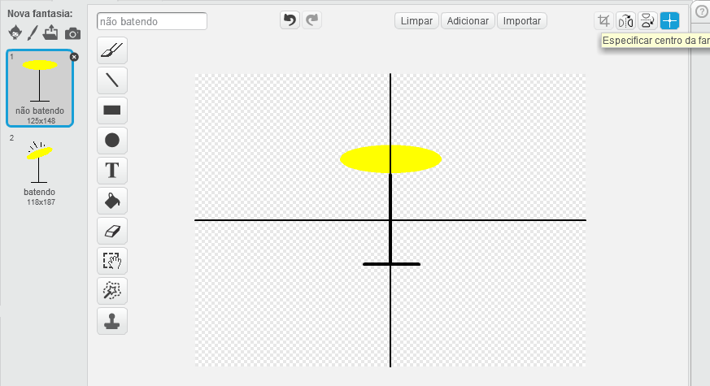

--- challenge ---

## Desafio: Faça a sua própria banda

Use o que você aprendeu neste projeto para fazer sua própria banda! Você pode criar qualquer instrumento que quiser — veja os sons e instrumentos disponíveis para obter algumas ideias.

Seus instrumentos não precisam fazer sentido. Por exemplo, você poderia fazer um piano feito de bolinhos!

Além de usar os atores da biblioteca, você também pode desenhar os seus próprios atores.

--- collapse ---
---
title: Por que o meu ator está 'pulando' quando muda de roupa?
---
+ Ao criar o seu próprio ator, você pode descobrir que quando você clica nele, ele 'pula' quando muda de fantasia. Isso ocorre porque as duas fantasias não estão centralizadas no mesmo lugar.

Para corrigir isso, clique em **Escolher centro da fantasia** em ambas fantasias, e certifique-se de que o centro esteja no mesmo ponto para elas.

--- /collapse ---

Se você tem um microfone, você pode gravar seus próprios sons ou até mesmo usar uma webcam para tocar os seus instrumentos!

--- /challenge ---
***
### Tradução Contribuída pela Comunidade 

Este projeto foi traduzido por **Silvio Casagrande/Edson Dario** e revisado por **Elton Marques**.

Nossos incríveis voluntários de tradução nos ajudam a dar as crianças em todo o mundo a oportunidade de aprender a programar. Você pode nos ajudar a alcançar mais crianças traduzindo nossos projetos - leia mais em [rpf.io/translators](https://rpf.io/translators).

