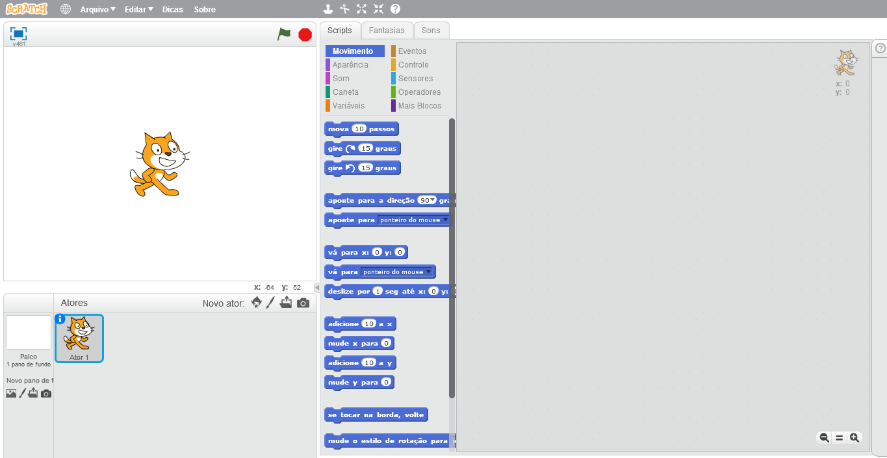
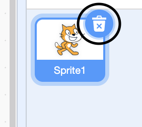
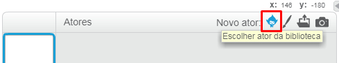
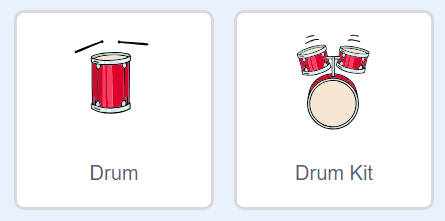
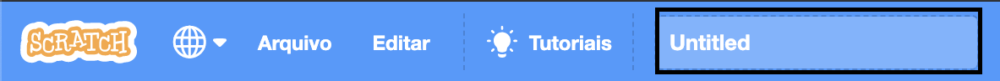
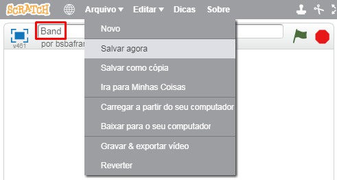

## Atores

Antes de começar a codificar, você precisará adicionar uma 'coisa' ao código. No Scratch, essas 'coisas' são chamadas de **atores**.

--- task ---

Abra um novo projeto Scratch.

**Online:** abra um novo projeto online do Scratch em [rpf.io/scratch-new](http://rpf.io/scratch-new){:target="_blank"}.

**Offline:** abra um novo projeto no editor offline.

Se você precisar baixar e instalar o editor offline do Scratch, poderá encontrá-lo em [rpf.io/scratchoff](http://rpf.io/scratchoff){:target="_blank"}.

É algo assim:

--- /task ---

--- task ---

O ator de gato que você consegue ver é o mascote do Scratch. Você não precisa dele para esse jogo, então remova-o clicando no X que está no canto superior direito.

--- /task ---

--- task ---

A seguir, clique em **Escolher um ator da biblioteca** para abrir uma lista de todos os atores do Scratch.

--- /task ---

--- task ---

Desça ate você encontrar um ator de tambor. Clique em um tambor para adicioná-lo ao seu projeto.

--- /task ---

--- task ---

Clique e arraste o tambor para a parte inferior do Palco.

--- /task ---

--- task ---

Dê um nome a seu programa, digitando-o na caixa de texto no topo.

A seguir, clique em **Arquivo**, e então em **Salvar Agora** para salvar seu projeto.

Se você não estiver online ou não tem uma conta no Scratch, você pode salvar uma cópia do seu projeto clicando em **Baixar para o seu computador**.

--- /task ---