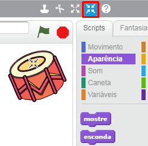

## Atores

Antes de começar a codificar, você precisará adicionar uma 'coisa' ao código. No Scratch, essas 'coisas' são chamadas de **atores**.

+ Primeiro, abra o editor Scracth. Você pode encontrar uma versão online em <a href="http://jumpto.cc/scratch-new" target="_blank">jumpto.cc/scratch-new</a>. A aparência é como esta:
    
    

+ O gato (ator) que você pode ver é o mascote do Scratch. Vamos nos livrar dele clicando com o botão direito e depois clicando em **apagar**.
    
    

+ Depois, clique em **Escolher ator da biblioteca** para ver a biblioteca de todos os atores no Scratch.
    
    

+ Desça até você ver um ator de tambor. Clique em um tambor e clique em **Ok** para adicioná-lo ao seu projeto.
    
    

+ Clique no ícone **Reduzir** e, em seguida, clique no tambor algumas vezes para torná-lo menor.
    
    

Dê ao seu programa um nome digitando na caixa de texto no canto superior esquerdo.

Você pode então clicar em **Arquivo** e depois **Salvar agora** para salvar seu projeto. Nota: Se você estiver usando a versão online do Scratch, mas não possui uma conta Scratch, você pode salvar uma cópia do seu projeto clicando em **Baixar para o seu computador**.

