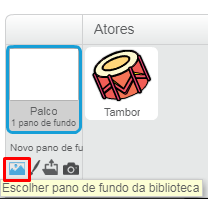
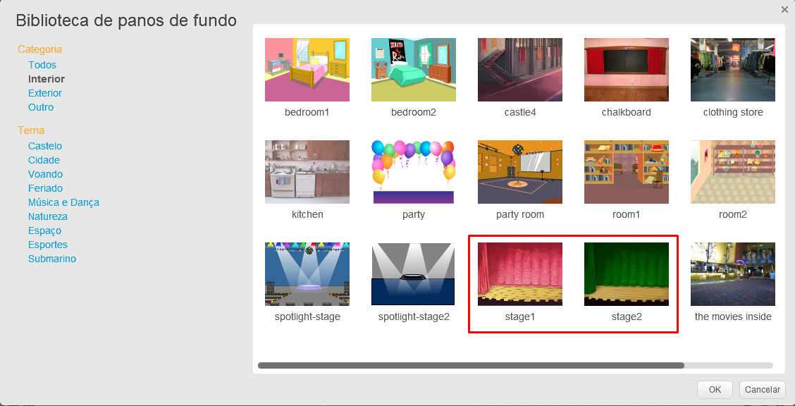

## O Palco

O **Palco** é a área à direita, e é onde seu projeto ganha vida. Pense nele como uma área de atuação, assim como um palco real!

\--- task \---

Neste momento, o palco está em branco e parece muito chato! Adicione um cenário clicando em **Escolher um cenário**.

\--- /task \---

\--- task \---

Clique em **Interior** no topo da página. Depois, clique em um cenário de teatro.

\--- /task \---

\--- task \---

Click and drag the drum to the bottom of the Stage.

\--- /task \---

\--- task \---

Your stage should now look similar to this:

\--- /task \---