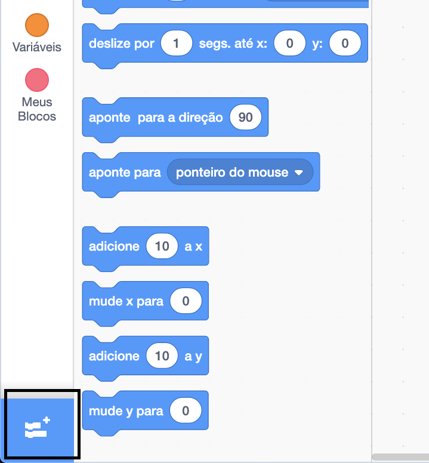
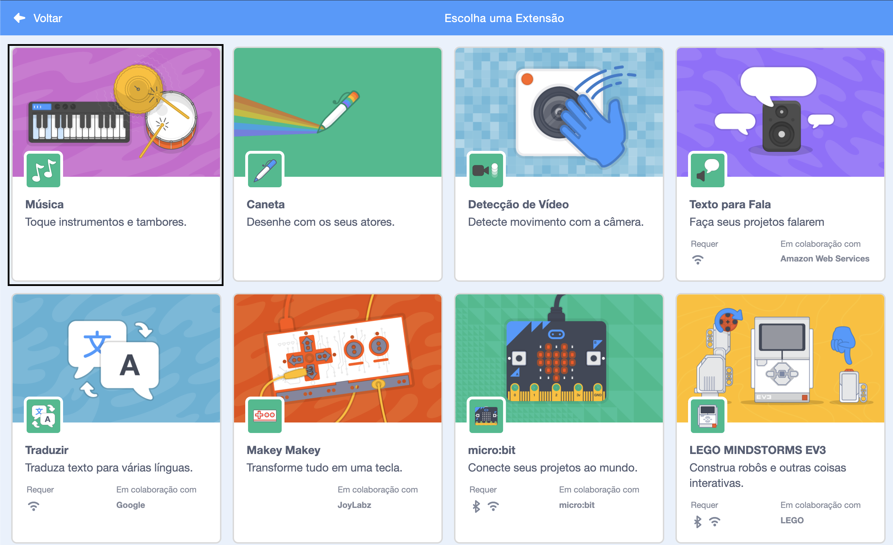
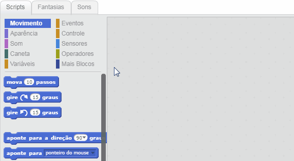

## Fazendo um tambor

Agora você vai adicionar código ao seu tambor para que ele faça um som quando for clicado.

Você pode encontrar os blocos de código na guia Scripts e eles são todos agrupados por cores!

--- task ---

Primeiro adicione a extensão **Música** para que você possa tocar instrumentos.

Clique no botão **Adicionar Extensão** no canto inferior esquerdo.



Clique na extensão **Música** para adicioná-la.



--- /task ---

--- task ---

Clique no ator de tambor, e então arraste estes dois blocos para a área de código à direita:

```blocks3
quando este ator for clicado
toque instrumento (\(1\) Tarol) por (0.25) batidas
```

--- no-print ---



--- /no-print ---

Certifique-se de que os blocos estejam conectados juntos (como tijolos de LEGO).

--- /task ---

--- task ---

Clique no tambor para experimentar seu novo instrumento!

--- /task ---