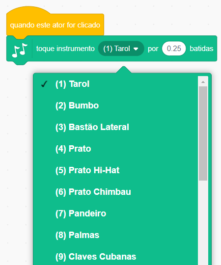
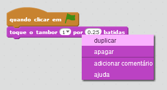

## Desafio: melhore o seu tambor

Você pode mudar o som produzido pelo tambor quando ele é clicado?



Você também consegue fazer com que o tambor toque um som quando a barra de espaço é pressionada? Você vai precisar usar este bloco de `evento`{:class="block3events"}:

```blocks3
when [space v] key pressed
```

Se você quiser copiar seu código atual, clique com o botão direito do mouse sobre ele e selecione **duplicar**.

