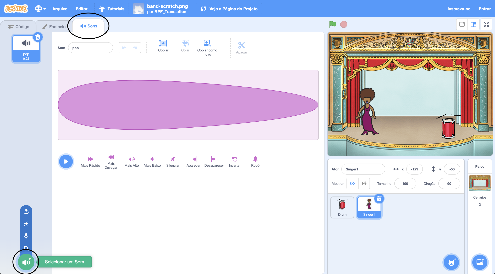
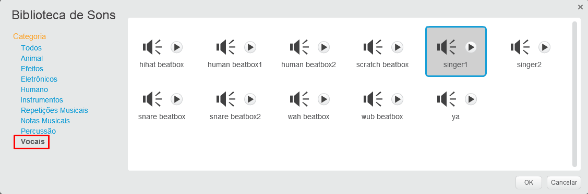

## Fazendo um cantor(a)

Agora você vai adicionar um cantor à sua banda!

--- task ---

Adicione um ator de cantor ao seu palco.


[[[generic-scratch3-sprite-from-library]]]

--- /task ---

--- task ---

Antes de fazer seu cantor cantar, você precisa adicionar um som ao ator do seu cantor. Certifique-se de que você selecionou o seu ator de cantor, e então, clique na aba Sons e selecione **Escolher som da biblioteca**:



--- /task ---

--- task ---

Clique em **Voz** na lista no topo da página, e então escolha um som para adicionar ao seu ator.



--- /task ---

--- task ---

Para usar o som, adicione os seguintes blocos de código ao seu ator de cantor:

```blocks3
when this sprite clicked
play sound (singer1 v) until done
```

--- /task ---

--- task ---

Clique na sua cantora no palco e veja o que acontece. Ela canta?

--- /task ---