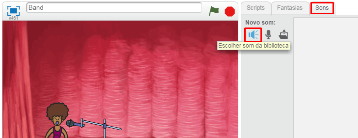

## Fazendo um cantor(a)

Vamos adicionar um cantor(a) à sua banda!

+ Adicione outros dois atores ao seu palco: uma atriz e um microfone.
    
    

+ Antes que você possa fazer a sua cantora cantar, você precisa adicionar um som a sua atriz. Certifique-se de ter selecionado sua cantora, clique na aba Sons e clique em **Escolher som da biblioteca**:
    
    

+ Se você clicar em **Vocais** no lado esquerdo, você poderá escolher um som adequado para adicionar a sua atriz.
    
    

+ Agora que o som foi adicionado, você pode incluir este código a sua cantora:
    
    ```blocks
        quando este ator for clicado
        toque o som [singer1 v] até o fim
    ```

+ Clique na sua cantora e veja o que acontece. Ela canta?
