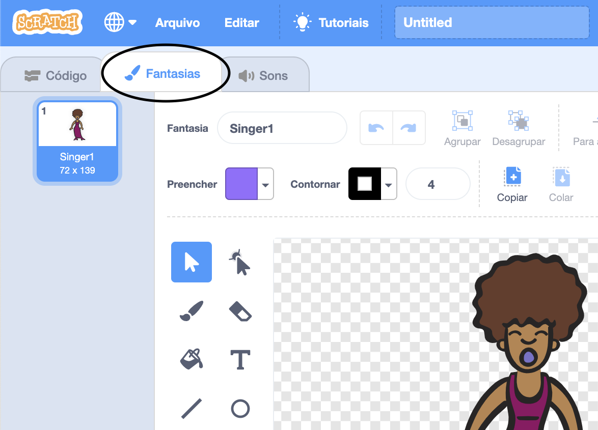
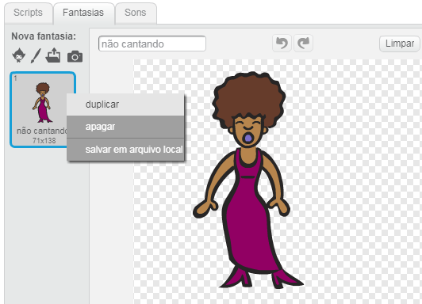
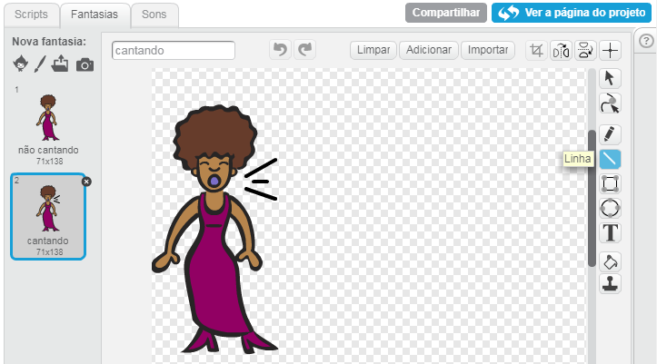
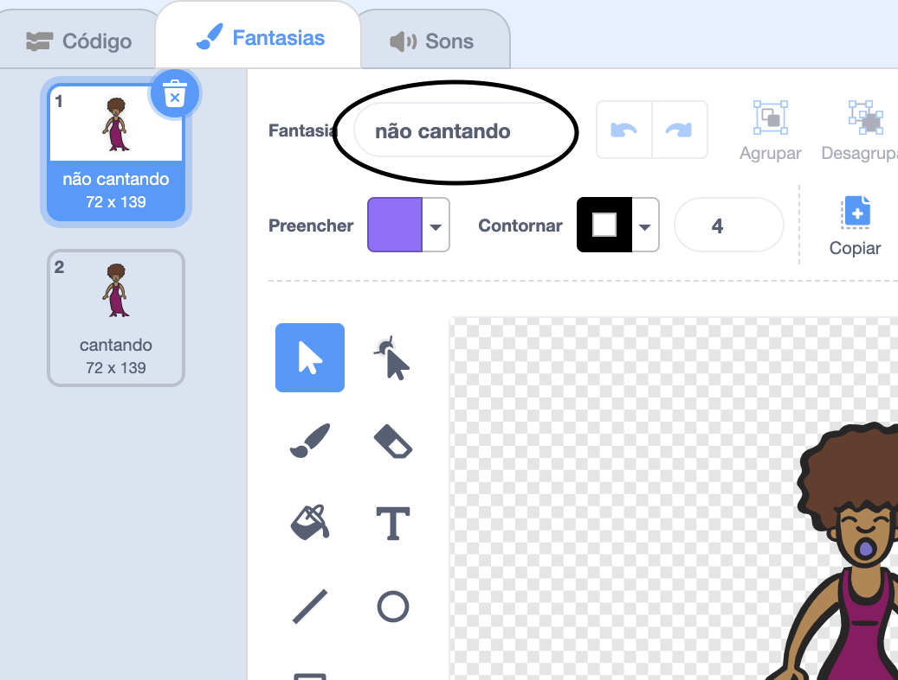

## Fantasias

Agora vamos fazer sua cantora parecer que está cantando!

--- task ---

Você pode mudar a aparência do seu ator de cantora quando ela é clicada, criando uma uma nova fantasia. Clique na aba Fantasias e você verá a fantasia da cantora.



--- /task ---

--- task ---

Clique com o botão direito na fantasia e selecione **duplicar** para criar uma cópia dela.



--- /task ---

--- task ---

Clique na nova fantasia (chamada 'Singer2') e, em seguida, selecione a ferramenta de linha e desenhe linhas para fazer parecer que a sua cantora está cantando.



--- /task ---

--- task ---

Os nomes atuais das fantasias não são muito úteis. Digite nas caixas de texto das fantasias para mudar seus nomes para 'não cantando' e 'cantando'.



--- /task ---

--- task ---

Agora que você tem duas fantasias diferentes para sua cantora, você pode escolher qual delas será exibida! Adicione esses dois blocos de código ao seu ator de cantora:

```blocks3
when this sprite clicked
+switch costume to (cantando v)
play sound (singer1 v) until done
+switch costume to (não cantando v)
```

O bloco de código para mudar a fantasia está na seção `Aparência`{:class="block3looks"}.

--- /task ---

--- task ---

Clique na sua cantora no palco. Parece que ela está cantando?

--- /task ---

--- task ---

Agora faça com que seu tambor pareça que está sendo tocado!


- Use as instruções usadas para mudar o ator da fantasia da sua cantora para te ajudar.

Lembre-se de testar se o seu novo código funciona!

--- /task ---