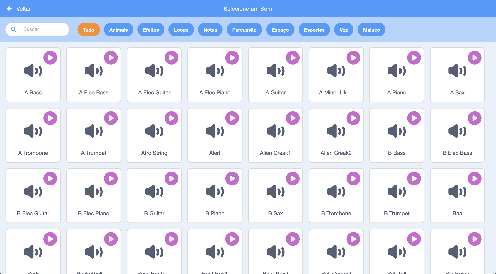
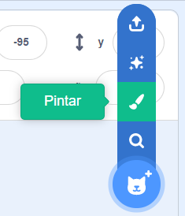
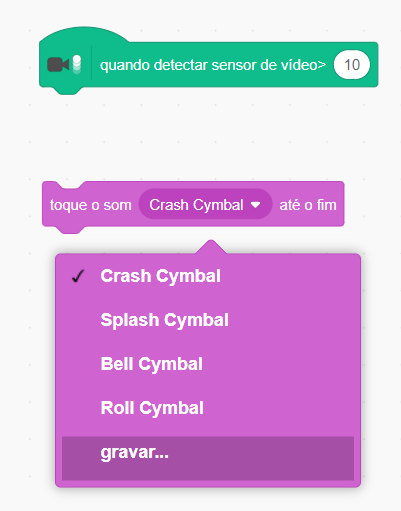

## Desafio: melhore sua banda

Use o que você aprendeu neste projeto para criar a sua própria banda! Você pode criar qualquer instrumento que quiser — veja os atores de instrumentos e sons disponíveis para ter algumas ideias.



```blocks3
quando este ator for clicado
mudar instrumento para (\(1\) Piano v)
toque a nota (60) por (0.25) batidas
```

Seus instrumentos não precisam ser de verdade. Por exemplo, você pode criar um piano feito de bolinhos!


Você pode usar mais atores da biblioteca, e você também pode pintar seus próprios atores!



## \--- collapse \---

## title: Por que o meu ator está 'pulando' quando muda de roupa?

Ao criar o seu próprio ator, você pode descobrir que quando você clica nele, ele 'pula' quando muda de fantasia. Isso ocorre porque as duas fantasias não estão centralizadas no mesmo lugar.

Para consertar isso, verifique se os centros das fantasias de seus atores são os mesmos.

\--- /collapse \---

Se você tem um microfone, você pode gravar seus próprios sons e até mesmo usar uma webcam para tocar os seus instrumentos!

