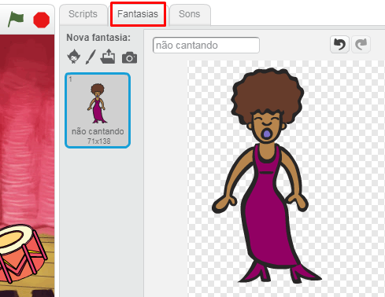
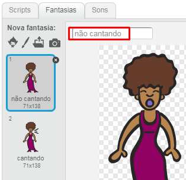
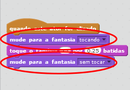

## Fantasias

Vamos fazer sua cantora parecer está cantando!

+ Você também pode mudar o visual da sua cantora, criando uma nova fantasia. Para quando ela for clicada, mudar de visual. Clique na aba Fantasias e você verá a imagem da cantora.
    
    

+ Clique com o botão direito na fantasia e clique em **duplicar** para criar uma cópia da fantasia.
    
    

+ Clique na nova fantasia (chamado 'Singer2') e, em seguida, selecione a ferramenta de linha e desenhe linhas para fazer parecer que a sua cantora está cantando.
    
    

+ Os nomes das fantasias não são muito úteis no momento. Renomeie as duas para que elas sejam chamadas de 'não cantando' e 'cantando' digitando o novo nome de cada fantasia na caixa de texto.
    
    

+ Agora que você tem duas fantasias diferentes para a sua cantora, você pode escolher qual será exibida! Adicione estes dois blocos a sua cantora:
    
    
    
    O bloco de código para mudar a fantasia está na seção `Aparência`{:class="blocklooks"}.

+ Clique na sua cantora. Ela parece estar cantando?