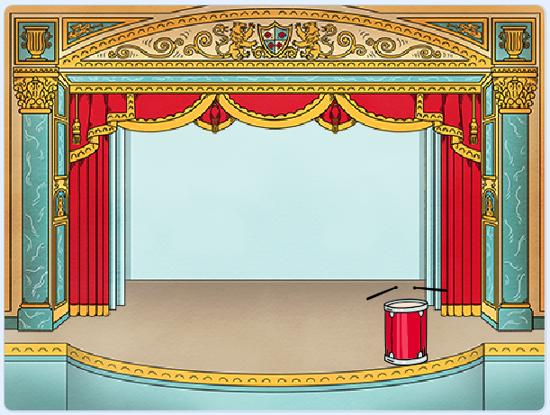

## O palco

O **Palco** é a área à direita e é onde o teu projeto ganha vida. Pensa nela como uma área de atuação, exatamente como acontece num palco real!

--- task --- De momento, o palco está em branco e parece muito chato! Adiciona um cenário clicando em **Escolher um cenário**.

 --- /task ---

--- task --- Clica em **Interior** na lista no topo. Depois, seleciona um cenário de teatro.

 --- /task ---

--- task --- O teu cenário deve agora ser semelhante a este:

 --- /task ---