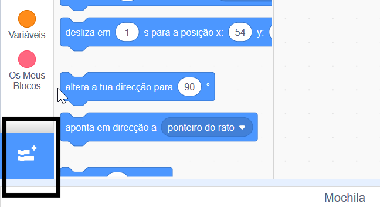
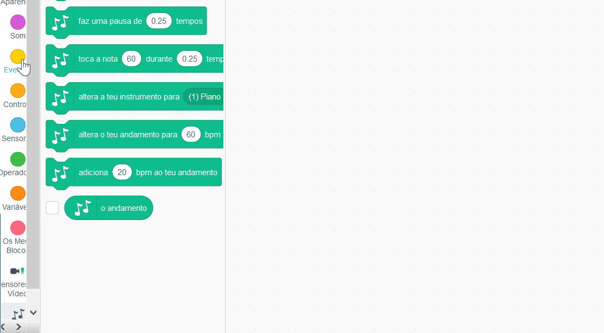

## Fazer um tambor

Agora vais adicionar código ao teu tambor para que o tambor emita um som ao ser clicado.

Podes encontrar os blocos de código separador de código, e todos são classificados por cores!

\--- task \---

Primeiro acrescenta a extensão ** Musica ** para que possas tocar instrumentos.

Clica no botão ** Adicionar extensão ** no canto inferior esquerdo.



Clique na extensão ** Música ** para a adicionar.


\--- /task \---

\--- task \--- Clique no ator de tambor e arrasta esses dois blocos para a área de código à direita:

```blocks3
when this sprite clicked
play drum (\(1\) Snare Drum v) for (0.25) beats
```

\--- no-print \---



\--- /no-print \---

Certifica-te de que os blocos estão ligados juntos (como tijolos LEGO).

\--- /task \---

\--- task \--- Clica no tambor para experimentar o teu novo instrumento! \--- / tarefa \---