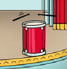

## Trajes

Agora vais fazer com que pareça que a tua cantora está a cantar!

\--- task \--- Podes alterar a aparência do seu ator de cantor quando é clicado, criando um novo traje. Clica na aba Trajes e vais ver o traje do cantor.

 \--- /task \---

\--- task \--- Clica com o botão direito do rato no traje e clica em ** duplicar ** para criar uma cópia.

 \--- /task \---

\--- task \--- Clica no novo traje (chamado 'Singer2'), seleciona a ferramenta de linhas e desenha algumas linhas para que pareça que o teu cantor está a emitir sons.

 \--- /task \---

\--- task \--- Os nomes atuais dos trajes não são muito úteis. Usa as caixas de texto dos trajes para alterar os seus nomes para 'não cantando' e 'cantando'.

 \--- /task \---

\--- task \--- Agora que tens dois trajes diferentes para o teu cantor, podes escolher qual a roupa que será exibida! Adiciona estes dois blocos de código ao teu ator de cantor:

```blocks3
when this sprite clicked
+switch costume to (singing v)
play sound (singer1 v) until done
+switch costume to (not singing v)
```

O bloco de código para mudar o traje está na secção de códigos de ` aparência ` {: class = "block3looks"}. \--- / tarefa \---

\--- task \--- Clica no teu cantor no palco e vê o que acontece. Canta? \--- / task \---

\--- task \--- Agora faz com que o teu tambor pareça estar a ser tocado!



- Usa a ajuda das instruções para mudar o traje do teu ator cantor.

Lembra-te de testar se o novo código funciona! \--- / task \---