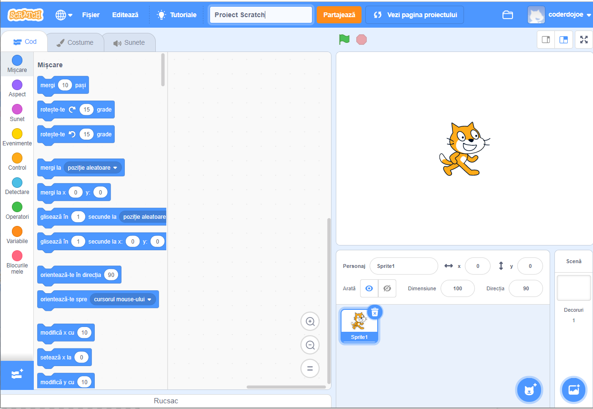
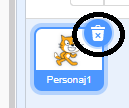
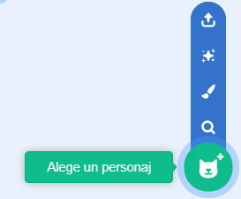
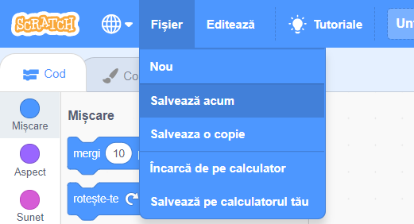

## Personaje

Înainte de a începe să programezi, trebuie să adaugi „un lucru” în codul tău. În Scratch, aceste „lucruri” se numesc **personaje**.

--- task ---

Deschide un nou proiect Scratch.

**Online:** deschide un nou proiect Scratch la [rpf.io/scratch-new](http://rpf.io/scratch-new){:target="_blank"}.

**Offline:** deschide un nou proiect în editorul offline.

Dacă trebuie să descărci și să instalezi editorul Scratch offline, îl poți găsi la [rpf.io/scratchoff](http://rpf.io/scratchoff){:target="_blank"}.

Arată așa:

--- /task ---

--- task ---

Personajul pisică pe care îl vezi este mascota Scratch. Nu ai nevoie de el pentru acest joc, așa că scapă de el dând click dreapta pe el și apoi dând click pe **șterge**.

--- /task ---

--- task ---

Apoi, dă click pe **Alege un personaj** pentru a deschide o listă cu toate personajele disponibile din Scratch.

--- /task ---

--- task ---

Derulează până în dreptul tobei. Dă click pe tobă pentru a o adăuga proiectului tău.

--- /task ---

--- task ---

Dă click și trage toba în partea de jos a scenei.

--- /task ---

--- task ---

Dă un nume programului tău prin introducerea denumirii în caseta text de sus.

Apoi dă click pe **Fișier**, și apoi pe **Salvează acum** pentru a salva proiectul.

Dacă nu ești online sau nu ai un cont Scratch, poți să salvezi o copie a proiectului tău dând click în schimb pe **Salvează pe calculatorul tău**.

--- /task ---