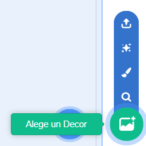
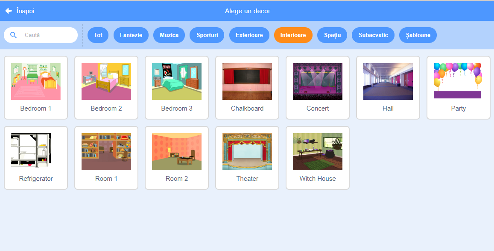

## Scena

**Scena** este zona din dreapta, și este locul unde proiectele tale prind viață. Gândește-te la ea ca la un loc de reprezentație, exact ca o scenă adevărată!

\--- task \---

Momentan, scena este albă și arată destul de plictisitor! Adăugă un decor dând click pe **Alege un Decor**.

\--- /task \---

\--- task \---

Dă click pe **Interioare** în listă în partea de sus. Apoi, dă click pe un decor de teatru.

\--- /task \---

\--- task \---

Click and drag the drum to the bottom of the Stage.

\--- /task \---

\--- task \---

Your stage should now look similar to this:

\--- /task \---