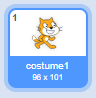

## Personaje

Înainte de a începe codul, trebuie să adugi ceva codului tău. în Scratch, aceste lucruri se numesc **sprites**.

+ Mai întâi deschideți esitorul Scratch. Poți găsi editorul Scratch online la <a href="http://jumpto.cc/scratch-new" target="_blank">jumpto.cc/scratch-new</a>. Arată astfel:
    
    

+ Personajul pisică pe care-l vedeți este chiar mascota Scratch. Haideți să scăpăm de ea apăsând clic dreapta si mai apoi **delete**.
    
    

+ Apoi, clic **Choose sprite from library**pentru a deschide o listă cu toate personajele disponibile din Scratch.
    
    

+ Derulează până în dreptul tobei. Apasă pe tobă, apoi **OK** Pentru a o adăuga proiectului tău.
    
    

+ Faceți clic pe icoana **shrink** și apoi clic pe tobă, de mai multe ori, pentru a o micșora.
    
    

Dă-i programului tău un nume, în cutia text din partea stânga-sus a ecranului.

Apasă**File** și apoi **Save now** Pentru a salva proiectul tău. Dacă nu ai deja un cont Scratch, poți salva o copie a proiectului tau apasând **Download to your computer**.

