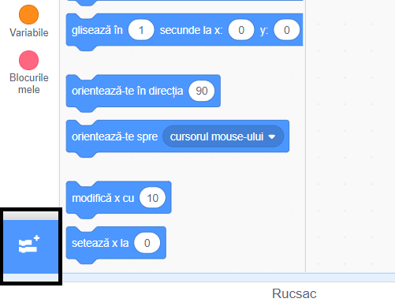
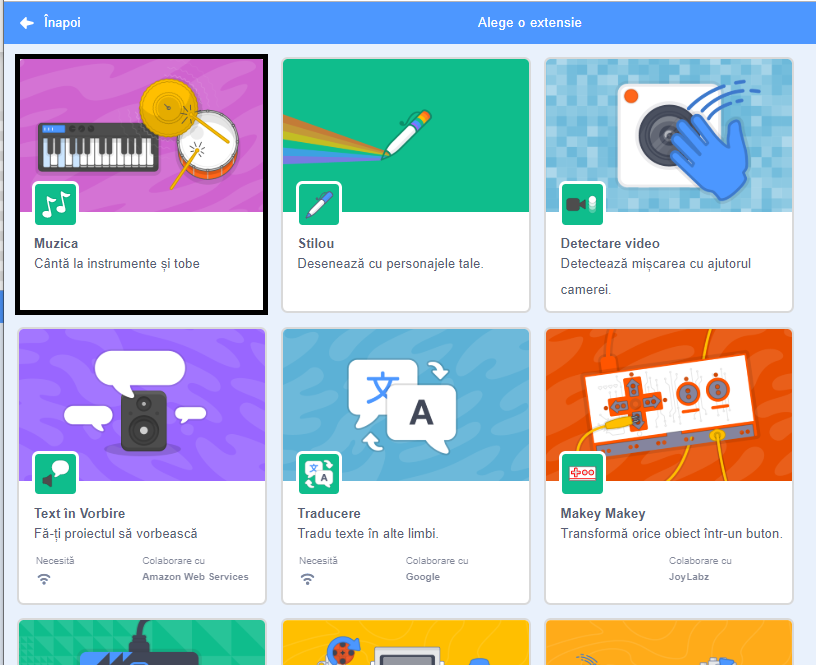
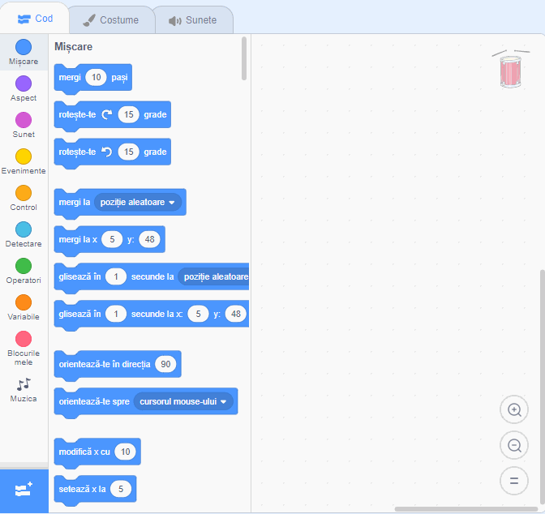

## Creează o tobă

Acum vei adăuga cod tobei tale, astfel încât toba să scoată un sunet atunci când se dă click pe ea.

Poți găsi blocurile în tab-ul Cod, toate blocurile având coduri de culori!

\--- task \---

Mai întâi, adăugă extensia **Muzica** astfel încât să poți cânta la instrumente.

Dă click pe butonul **Adaugă o extensie** în colțul din stânga jos.



Dă click pe extensia **Muzica** pentru a o adăuga.



\--- /task \---

\--- task \---

Click on the drum sprite, and then drag these two blocks into the code area on the right:

```blocks3
când se dă click pe acest personaj
cântă la tobă ((1) Snare Drum v) pentru (0.25) bătăi
```

\--- no-print \---



\--- /no-print \---

Make sure that the blocks are connected together (like LEGO bricks).

\--- /task \---

\--- task \---

Click on the drum to try out your new instrument!

\--- /task \---