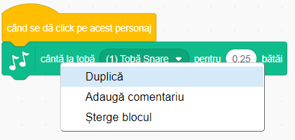

## Provocare: îmbunătățește-ți toba

Poți schimba sunetul pe care îl face toba, atunci când se dă click pe ea?


Poți face ca toba să scoată un sunet atunci când e apăsată tasta spațiu? Va trebui să folosești acest bloc de tipul `eveniment`{:class="block3events"}:

```blocks3
când tasta [space v] este apăsată
```

Dacă vrei sa copiezi codul tău existent, dă click pe el și apoi pe **duplică**.

