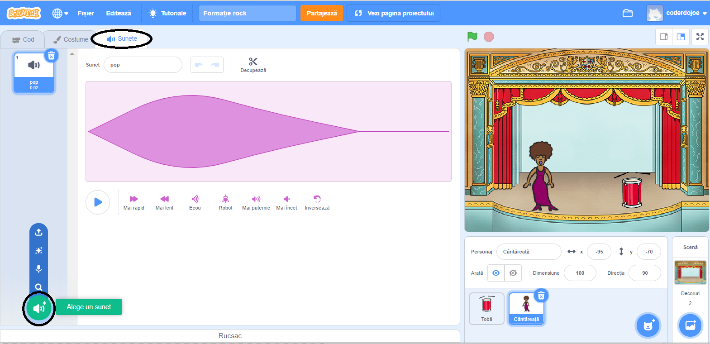
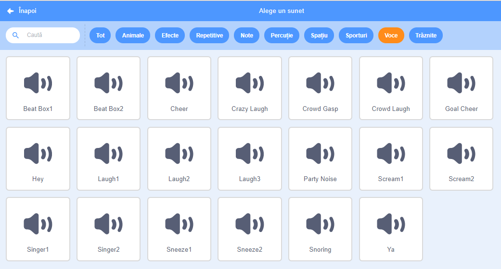

## Creează o cântăreață

Acum vei adăuga o cântăreață la trupa ta!

\--- task \---

Adaugă un personaj care cântă pe scena ta.


[[[generic-scratch3-sprite-from-library]]]

\--- /task \---

\--- task \---

Înainte să faci cântăreața să cânte, trebuie să îi adaugi un sunet. Asigură-te că ai ales cântăreața, și apoi dă click pe tabul Sunete, și dă click pe **Alege un sunet**:



\--- /task \---

\--- task \---

Dă click pe **Voce** în lista din partea de sus, iar apoi alege sunetul pe care vrei să îl adaugi personajului tău.



\--- /task \---

\--- task \---

Pentru a folosi sunetul, adaugă următoarele blocuri personajului tău:

```blocks3
când se dă click pe acest personaj
redă sunetul (singer1 v) până la final
```

\--- /task \---

\--- task \---

Dă click pe cântăreața ta de pe scenă și vezi ce se întâmplă. Cântă?

\--- /task \---