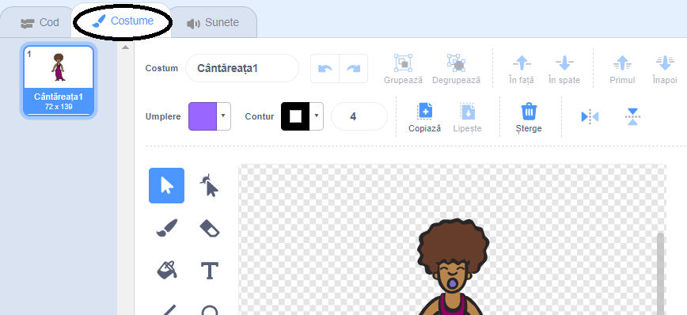
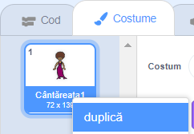
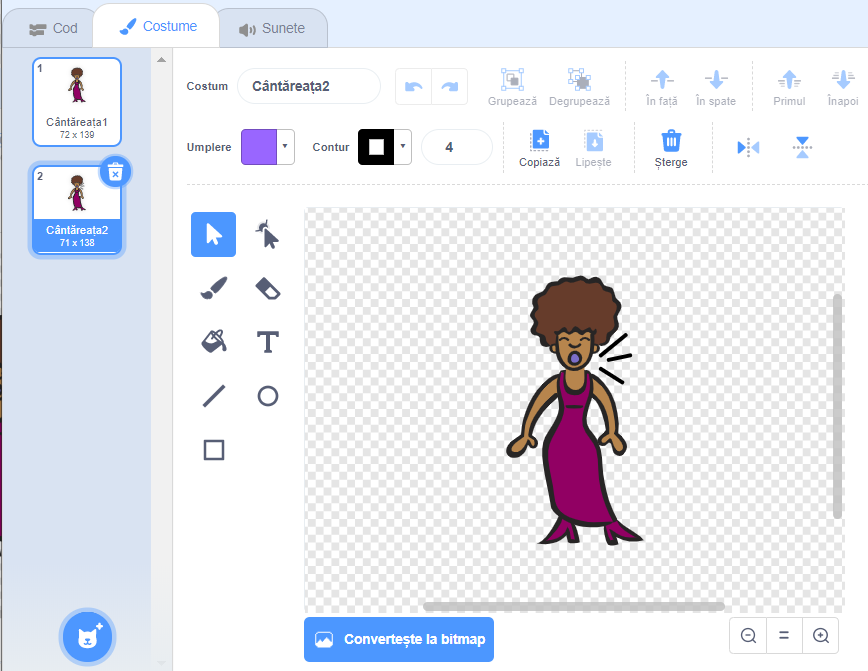
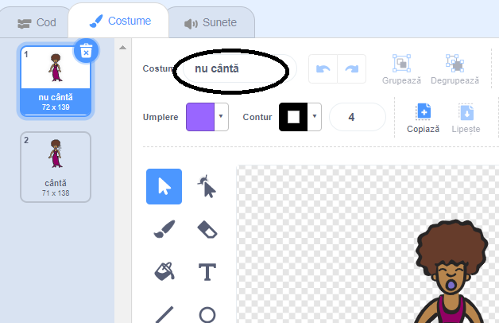

## Costume

Acum o să faci cântăreața să arate ca și cum ar cânta!

\--- task \---

Poți schimba modul în care arată personajul tău, atunci când e apăsat, adăugându-i un nou costum. Apasă pe tabul Costume, și vei vedea costumul cântăreței.



\--- /task \---

\--- task \---

Dă click-dreapta pe costum și apoi dă click pe **duplică** pentru a crea o copie a costumului.



\--- /task \---

\--- task \---

Dă click pe noul costum (numit „Singer2”), apoi selectează linia din bara de unelte și desenează linii astfel încât să pară cum cântăreața scoate sunet.



\--- /task \---

\--- task \---

Numele costumelor nu sunt de mare ajutor în acest moment. Tastează în căsuțele text ale costumelor pentru a schimba numele lor în „cântă” și „nu cântă”.



\--- /task \---

\--- task \---

Acum, că ai două costume diferite pentru cântăreața ta, poți alege care costum este afișat! Adaugă aceste două blocuri cântăreței:

```blocks3
când se dă click pe acest personaj
+schimbă costumul la (singing v)
redă sunetul (singer1 v) până la final
+schimbă costumul la (not singing v)
```

Blocul pentru schimbarea costumului este în secțiunea `Aspect`{:class="block3looks"}.

\--- /task \---

\--- task \---

Dă click pe cântăreața ta de pe scenă și vezi ce se întâmplă. Pare că ar cânta?

\--- /task \---

\--- task \---

Acum schimbă felul în care arată toba ta ca și cum ar fi lovită!


- Folosește instrucțiunile pentru schimbarea costumului personajului tău dacă ai nevoie de ajutor.

Nu uita să testezi dacă noul cod funcționează corect!

\--- /task \---