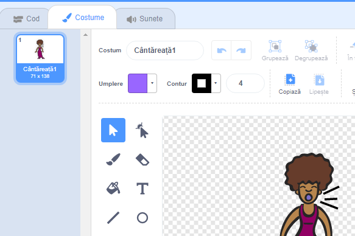
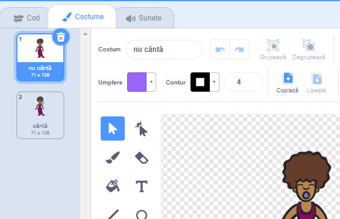

## Costume

Haide să facem cântăreața să arate ca și cum ar cânta!

+ De asemenea, poți schimba modul în care arată personajul tău, atunci când e apăsat, adăugându-i un nou costum. Apasa pe bara Costume, si vei putea vedea imaginea cântăreței.
    
    

+ Apasă clic-dreapta pe costum si clic **duplicate** pentru a crea o copie după costum.
    
    

+ Apasă pe noul costum (numit ‘Cântăreață2’), și apoi selectează linia din bara de unelte, și desenează astfel încât să pară cum cântăreața scoate sunete.
    
    

+ Numele costumelor nu sunt foarte utile în acest moment. Redenumiți cele două costume, astfel încât acestea să fie numite "nu cântă" și "cântă" prin tastarea noului nume în dreptul căsuței text.
    
    

+ Acum, că aveți două costume diferite pentru cântăreață, puteți alege care costum este afișat! Adăugați aceste două blocuri cântăreței:
    
    
    
    Blocul de coduri pentru schimbul de costume e in sectiunea`Looks`{:class="blocklooks"}.

+ Apasă pe cântăreață. Arată ca și cum ar cânta?