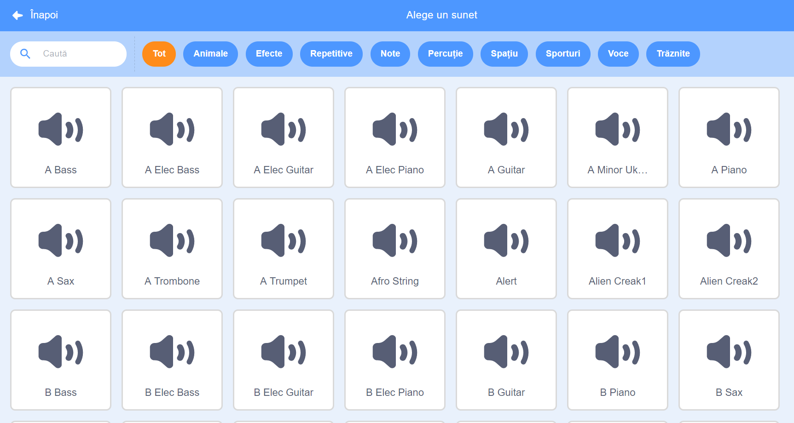
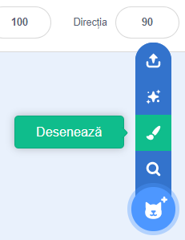
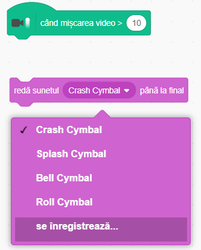

## Provocare: îmbunătățește-ți formația

Folosește tot ceea ce ai învățat în acest proiect pentru a-ți face propria ta formație! Poți crea orice instrument dorești — uită-te la sunetele și instrumentele disponibile, pentru a-ți face o idee.



```blocks3
când se dă click pe acest personaj
setează instrument la (\(1\) Piano v)
cântă nota (60) pentru (0.25) bătăi
```

Instrumentele tale nu trebuie să arate real totuși. Spre exemplu, poți crea un pian făcut din brioșe!


Poți folosi mai multe personaje din bibliotecă, și îți poți desena și propriile tale personaje!



--- collapse ---
---
title: De ce „sare” personajul meu atunci când i se schimbă costumul?
---

Atunci când îți creezi propriul personaj, e posibil să vezi că atunci când dai click pe el, „sare” atunci când își schimbă costumul. Asta se întâmplă deoarece cele două costume nu sunt centrate în același loc.

Pentru a fixa asta, asigură-te ca centrul costumelor personajelor este același.

--- /collapse ---

Dacă ai un microfon, poți înregistra sunetele tale, și poți să folosești chiar și o cameră web pentru a lovi instrumentele tale!

