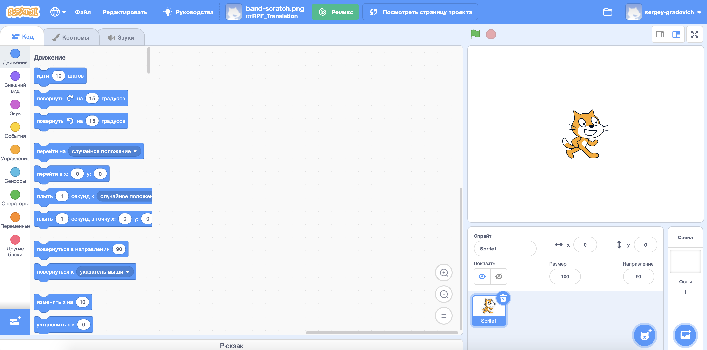
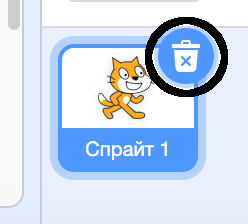
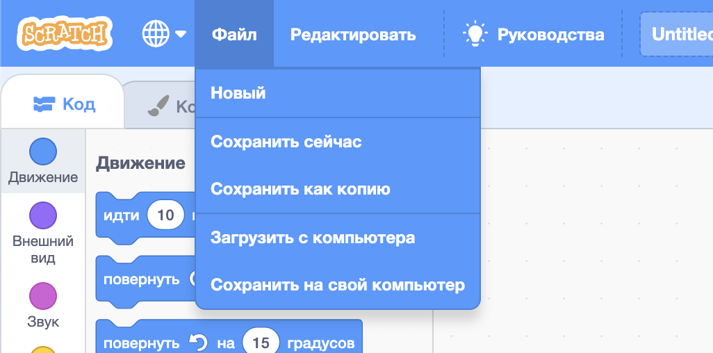

## Спрайты

Перед тем как начать программировать, тебе нужно добавить в код «объект». В Scratch эти «объекты» называются **спрайтами**.

\--- task \---

Открой новый проект Scratch.

**Онлайн:** открой новый онлайн проект Scratch [rpf.io/scratch-new](http://rpf.io/scratch-new){:target="_blank"}.

**Офлайн:** открой новый проект в автономном редакторе.

Если тебе нужно скачать и установить автономный редактор Scratch, ты можешь найти его по адресу [rpf.io/scratchoff](http://rpf.io/scratchoff){:target="_blank"}.

Он выглядит так:

\--- /task \---

\--- task \---

Спрайт кота, который ты видишь, это талисман Scratch. В этой игре он тебе не понадобится, поэтому ты можешь избавиться от него, щелкнув по крестику в углу.

\--- /task \---

\--- task \---

Далее нажми **Выбрать спрайт из библиотеки**, чтобы открыть список всех спрайтов Scratch.

\--- /task \---

\--- task \---

Прокрути вниз до тех пор, пока не увидишь спрайт барабана. Нажми на барабан, чтобы добавить его в свой проект.

\--- /task \---

\--- task \---

Щелкни и перетащи барабан в нижнюю часть сцены.

\--- /task \---

\--- task \---

Придумай своей программе имя и введи его в текстовое поле вверху.

Затем нажми **Файл**, а затем **Сохранить сейчас** для сохранения проекта.

Если ты не в сети или у тебя нет Scratch аккаунта, ты можешь сохранить копию своего проекта, нажав на **Сохранить на свой компьютер**.

\--- /task \---