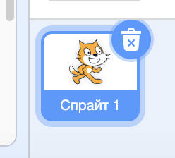

## Спрайты

Прежде чем вы сможете начать кодирование, вам нужно добавить код «вещь» в код. В Scratch эти «вещи» называются **спрайтами**.

+ Сначала откройте редактор Scratch. Вы можете найти онлайн-редактор Scratch по адресу <a href="http://jumpto.cc/scratch-new" target="_blank">jumpto.cc/scratch-new</a>. Это выглядит так:
    
    

+ Кошачий спрайт, который вы видите, это талисман Scratch. Давайте избавимся от него, щелкнув его правой кнопкой мыши, а затем нажав **delete**.
    
    

+ Затем нажмите **Выберите спрайт из библиотеки** чтобы открыть список всех спрайтов Scratch.
    
    

+ Прокрутите вниз, пока не увидите барабанный спрайт. Нажмите на барабан и нажмите **OK** чтобы добавить его в свой проект.
    
    

+ Нажмите значок **shrink** , а затем несколько раз нажмите на барабан, чтобы уменьшить его.
    
    

Дайте вашей программе имя, введя его в текстовое поле в верхнем левом углу.

Затем вы можете нажать **Файл** а затем **Сохранить сейчас** чтобы сохранить проект. Если у вас нет учетной записи Scratch, вы можете сохранить копию своего проекта, нажав **Загрузить на компьютер**.

