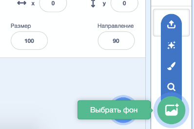
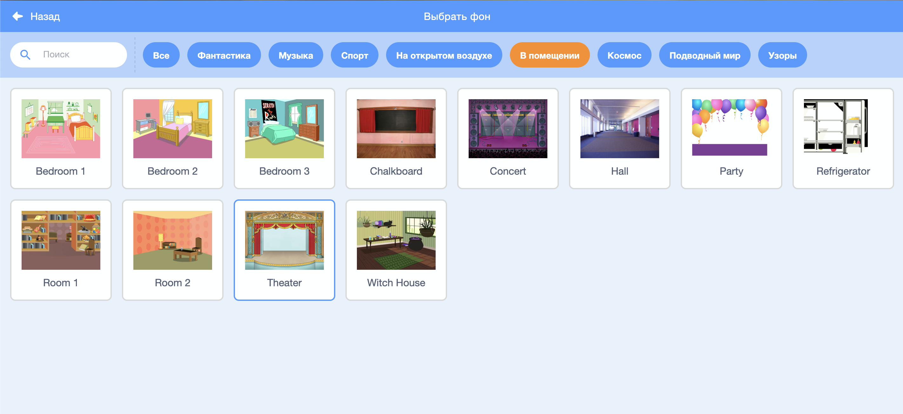

## Сцена

**Сцена** — это область справа и там твой проект оживает. Рассматривай её как театральную сцену, как настоящую сцену!

--- task ---

На данный момент сцена белая и выглядит довольно скучно! Добавь фон, нажав на **Выбрать фон**.

--- /task ---

--- task ---

Нажми **В помещении** в списке сверху. Затем нажми на театральный фон.

--- /task ---

--- task ---

Теперь твоя сцена должна выглядеть примерно так:

--- /task ---