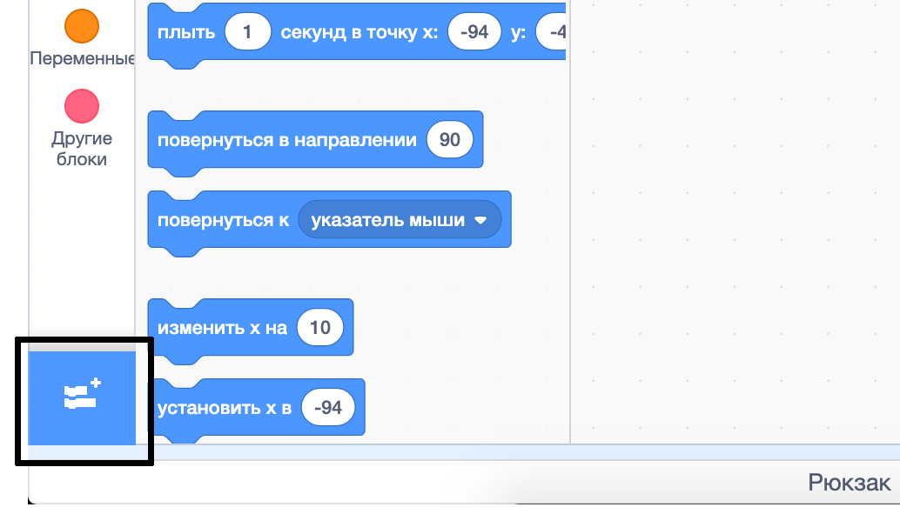
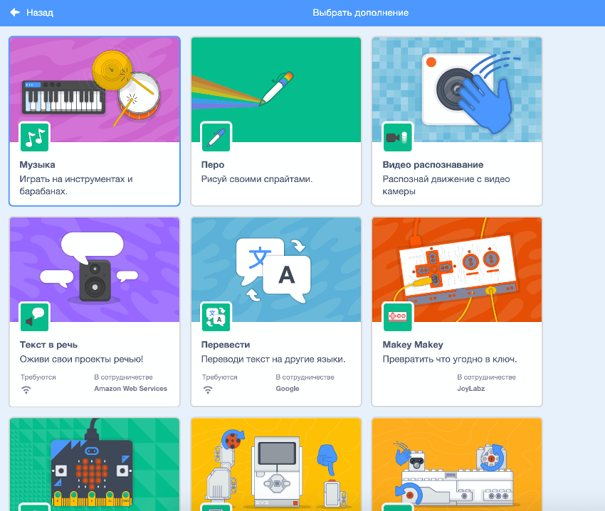
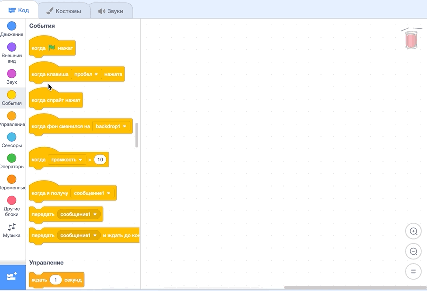

## Создание барабана

Теперь ты добавишь код к своему барабану, чтобы барабан издавал звук при нажатии на него.

Ты можешь найти блоки кода во вкладке Код, и все они размечены цветом!

--- task ---

Сначала добавь расширение **Музыка**, чтобы ты мог играть на инструментах.

Нажми кнопку **Добавить расширение** в левом нижнем углу.



Нажми на расширение **Музыка**, чтобы добавить его.



--- /task ---

--- task ---

Нажми на спрайт барабана, а затем перетащи эти два блока в область кода справа:

```blocks3
when this sprite clicked
play drum (\(1\) Snare Drum v) for (0.25) beats
```

--- no-print ---



--- /no-print ---

Убедись, что блоки соединены вместе (как детали LEGO).

--- /task ---

--- task ---

Нажми на барабан, чтобы опробовать свой новый инструмент!

--- /task ---