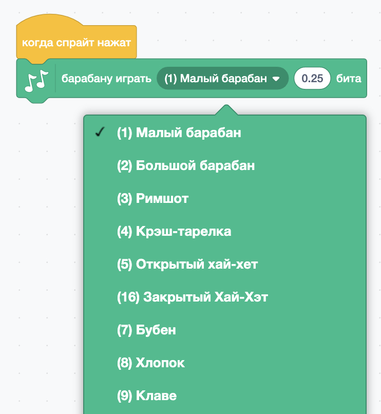
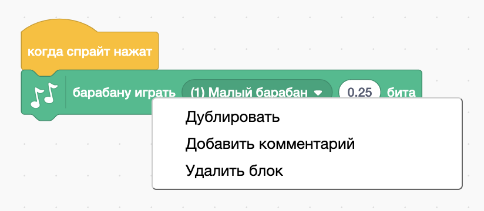

## Задание: улучши свой барабан

Можешь ли ты изменить звук, который издает барабан, когда на него нажимают?



Можешь ли ты заставить барабан издавать звук при нажатии клавиши пробела? Тебе нужно будет использовать это блок `событие`{:class="block3events"}:

```blocks3
when [space v] key pressed
```

Если ты хочешь скопировать свой существующий код, щёлкни на него правой кнопкой мыши, а затем нажми **дублировать**.

