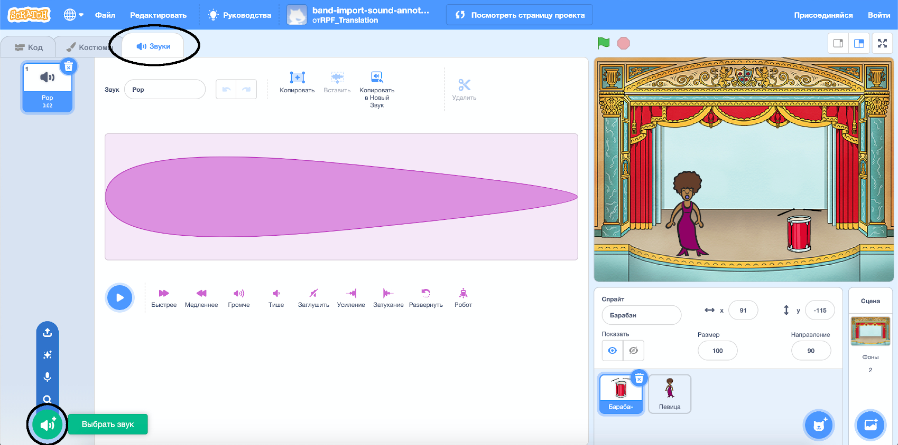
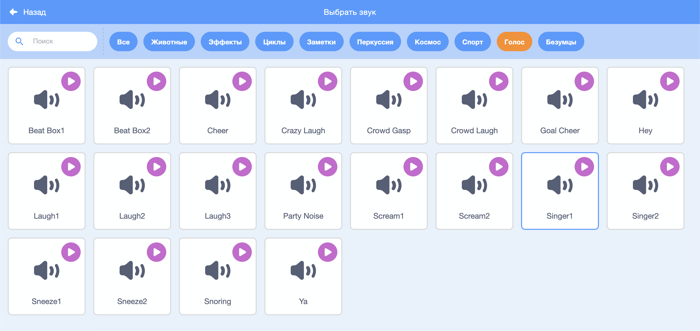

## Создание певицы

Теперь ты добавишь певицу в свою группу!

\--- task \---

Добавь спрайт певицы на свою Сцену.


[[[generic-scratch3-sprite-from-library]]]

\--- /task \---

\--- task \---

Прежде чем твоя певица сможет петь, тебе нужно добавить звук к своему спрайту певицы. Убедись, что ты выбрал свой спрайт певицы, затем нажми на вкладку Звуки и нажми на **Выбрать звук**:



\--- /task \---

\--- task \---

Нажми **Голос** в списке вверху, а затем выбери звук для добавления к твоему спрайту.



\--- /task \---

\--- task \---

Чтобы использовать звук, добавьте следующие блоки кода к своему спрайту певицы:

```blocks3
when this sprite clicked
play sound (singer1 v) until done
```

\--- /task \---

\--- task \---

Нажми на свою певицу на сцене и посмотри, что происходит. Она поет?

\--- /task \---