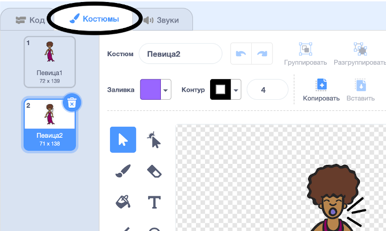
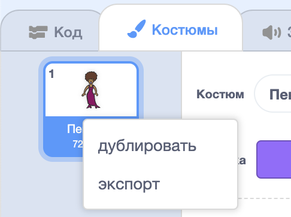
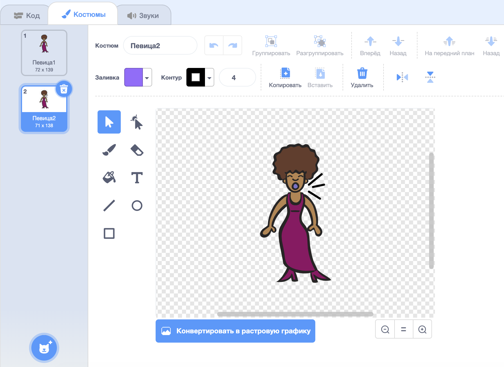
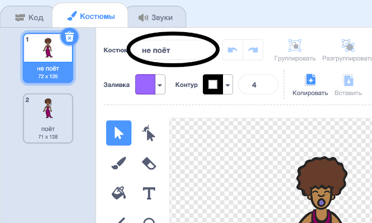

## Костюмы

Теперь ты сделаешь так, чтобы твоя певица выглядела словно она поёт!

--- task ---

Ты можешь изменить внешний вид спрайта певицы при нажатии на него, создав новый костюм. Нажми на вкладку Костюмы, и ты увидишь костюм певицы.



--- /task ---

--- task ---

Щелкни правой кнопкой мыши на костюме и затем нажми **дублировать**, чтобы создать его копию.



--- /task ---

--- task ---

Нажми на новый костюм (называется 'Singer2'), а затем выбери инструмент линия и нарисуй линии так, словно твоя певица издает звуки.



--- /task ---

--- task ---

Названия костюмов на данный момент не очень понятны. Введи текст в текстовые поля костюмов, чтобы изменить их имена на «не поёт» и «поёт».



--- /task ---

--- task ---

Теперь, когда у тебя есть два разных костюма для твоей певицы, ты можешь выбрать, какой костюм будет отображаться! Добавь эти два блока кода к спрайту твоей певицы:

```blocks3
when this sprite clicked
+switch costume to (поёт v)
play sound (singer1 v) until done
+switch costume to (не поёт v)
```

Блок кода для смены костюма находится в секции `Внешний вид`{:class="block3looks"}.

--- /task ---

--- task ---

Нажми на певицу на сцене. Она выглядит так, как будто поет?

--- /task ---

--- task ---

Теперь сделай так, будто по твоему барабану бьют!


- В этом тебе помогут инструкции по изменению костюма спрайта твоей певицы.

Не забудь проверить, что твой новый код работает!

--- /task ---