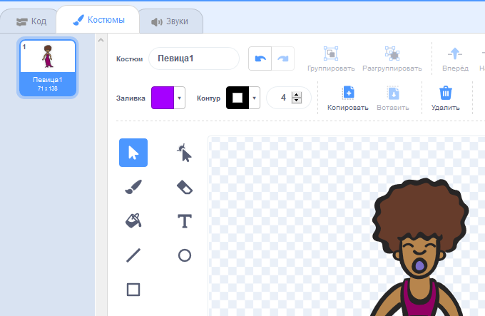
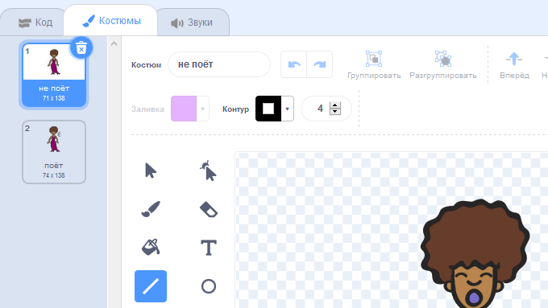

## костюмы

Давайте сделаем, чтобы ваш певец выглядел так, будто она поет!

+ Вы также можете изменить внешний вид вашего исполнителя, когда его нажмут, создав новый костюм. Перейдите на вкладку Костюмы, и вы увидите изображение певицы.
    
    

+ Щелкните правой кнопкой мыши по костюму и нажмите **дубликат** чтобы создать копию костюма.
    
    

+ Нажмите на новый костюм («Singer2»), а затем выберите инструмент линии и нарисуйте линии, чтобы он выглядел так, как будто ваш певец делает звук.
    
    

+ Названия костюмов на данный момент не очень полезны. Переименуйте два костюма, чтобы их называли «не петь» и «петь», введя новое имя каждого костюма в текстовое поле.
    
    

+ Теперь, когда у вас есть два разных костюма для певицы, вы можете выбрать, какой костюм будет показан! Добавьте эти два блока вашему певцу:
    
    
    
    Кодовый блок для изменения костюма находится в разделе `Looks`{: class = "blocklooks"}.

+ Нажмите на свою певицу. Кажется, она поет?