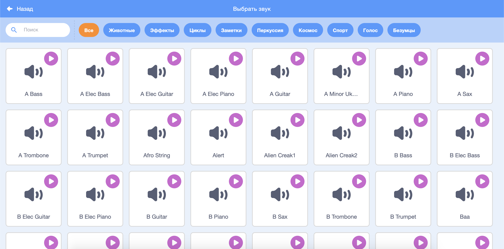
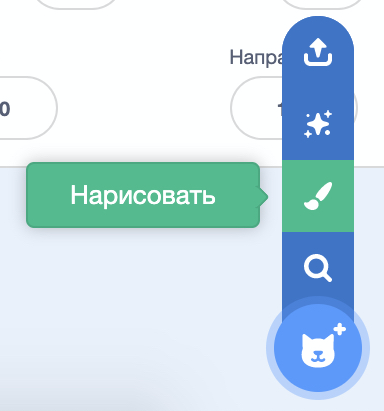
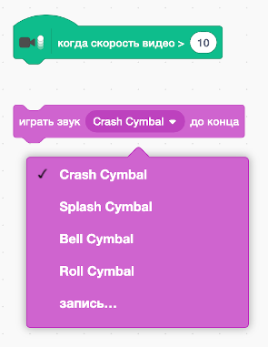

## Задание: улучши свою группу

Используй то, что ты узнал в этом проекте, чтобы создать свою собственную группу! Ты можешь создавать любые инструменты, которые тебе нравятся — посмотри на доступные спрайты инструментов и звуки, чтобы придумать несколько идей.



```blocks3
when this sprite clicked
set instrument to (\(1\) Piano v)
play note (60) for (0.25) beats
```

Кстати, твои инструменты не обязательно должны быть реалистичными. Например, ты можешь сделать пианино из кексов!


Ты можешь использовать больше спрайтов из библиотеки, а также можешь нарисовать свои собственные спрайты!



## \--- collapse \---

## title: Почему мой спрайт «прыгает», когда он меняет костюм?

При создании своего собственного спрайта ты можешь обнаружить, что, при нажатии на спрайт, он «прыгает» при изменении костюма. Это потому, что два костюма не находятся в одном и том же месте.

Чтобы это исправить, убедись, что центры костюмов твоего спрайта совпадают.

\--- /collapse \---

Если у тебя есть микрофон, ты можешь записывать свои собственные звуки, и ты даже можешь использовать веб-камеру, чтобы трогать твои инструменты!

