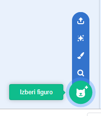
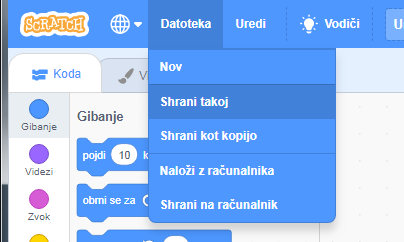

## Figure

Preden lahko začneš s programiranjem, moraš v kodo dodati neko 'stvar'. V Scratchu se takšne 'stvari' imenujejo **figure**.

\--- task \---

Ustvari nov Scratch projekt.

**S povezavo:** odpri nov spletni Scratch projekt na [rpf.io/scratch-new](http://rpf.io/scratch-new){:target="_blank"}.

**Brez povezave:** odprite nov projekt v namiznem Scratch urejevalniku.

Če želiš prenesti in namestiti Namizni Scratch, ga lahko najdeš na [rpf.io/scratchoff](http://rpf.io/scratchoff){: target = "_ blank"}.

To je videti tako:

\--- /task \---

\--- task \---

Figura mačke je maskota Scratcha. Za to igro je ne potrebuješ, zato se je znebi z desnim klikom na figuro, potem pa klikni še na **zbriši**.

\--- /task \---

\--- task \---

Sedaj klikni na **Izberi figuro**, da odpreš seznam vseh Scratch figur.

\--- /task \---

\--- task \---

Pomakni se navzdol, dokler ne najdeš bobna. Klikni nanj, da ga dodaš v svoj projekt.

\--- /task \---

\--- task \---

Klikni na boben in ga povleci na spodnjo stran odra.

\--- /task \---

\--- task \---

Poimenuj svoj program tako, da vneseš ime v polje za besedilo na vrhu.

Nato klikni **Datoteka** in **Shrani takoj**, da shraniš svoj projekt.

Če nisi povezan-a s spletom ali nimaš Scratch računa, lahko kopijo projekta shraniš s klikom na **Shrani na računalnik**.

\--- /task \---