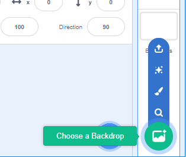
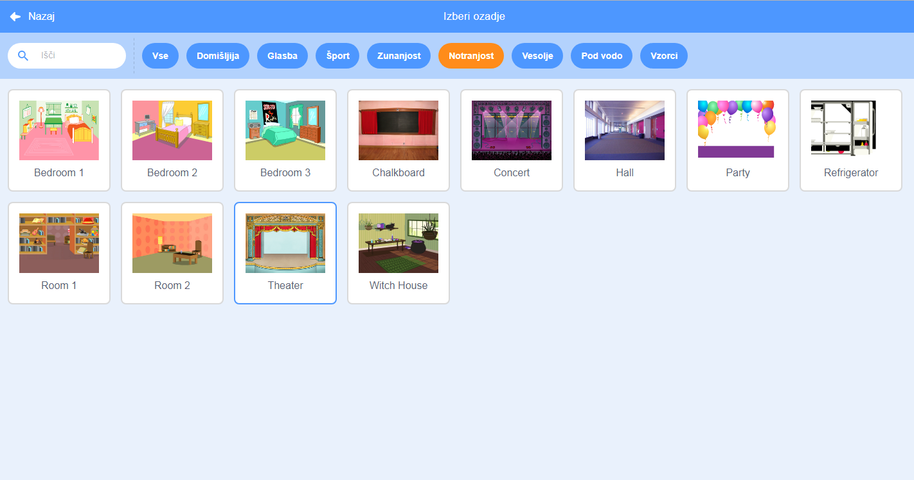

## Oder

**Oder** je področje na desni strani, kjer tvoj projekt oživi. O njemu razmišljaj, kot o površini za nastopanje, kakor pri pravem odru!

--- task ---

Trenutno je oder bel in izgleda precej dolgočasno! Dodaj mu ozadje s klikom na **Izberi ozadje**.

--- /task ---

--- task ---

Na vrhu seznama izberi **Notranjost**, potem pa klikni na sliko gledališča.

--- /task ---

--- task ---

Tvoj oder bi sedaj moral biti podoben temu:

--- /task ---