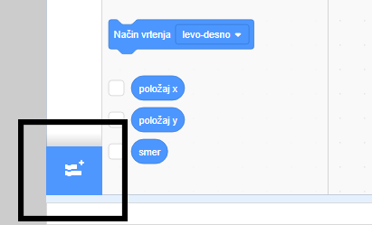
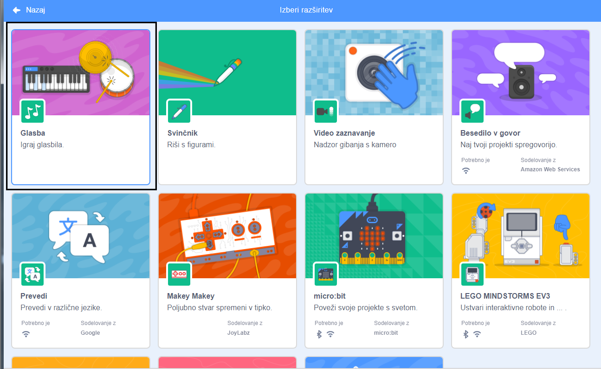
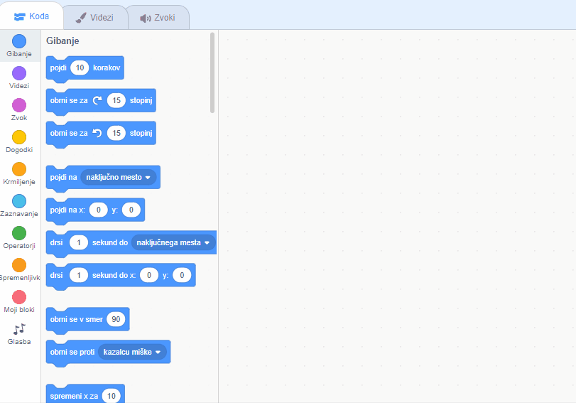

## Izdelava bobna

Sedaj boš svojemu bobnu dodal kodo, tako da bo boben ustvaril zvok, ko klikneš nanj.

V zavihku Koda lahko najdeš programske bloke, ki so vsi barvno označeni!

\--- task \---

Najprej dodaj razširitev **Glasba**, da lahko predvajaš instrumente.

Klikni na gumb **Dodaj razširitev** v spodnjem levem kotu.



Klikni na razširitev **Glasba**, da jo dodaš.



\--- /task \---

\--- task \---

Klikni na figuro bobna in potem povleci ta dva bloka v območje za programiranje na desni:

```blocks3
ko kliknemo to figuro
zaigraj na boben (\(1\) Mali boben v) za (0,25) udarcev
```

\--- no-print \---



\--- /no-print \---

Prepričaj se, da so bloki res povezani (kot LEGO kocke).

\--- /task \---

\--- task \---

Klikni na boben in preizkusi svoj novi instrument!

\--- /task \---