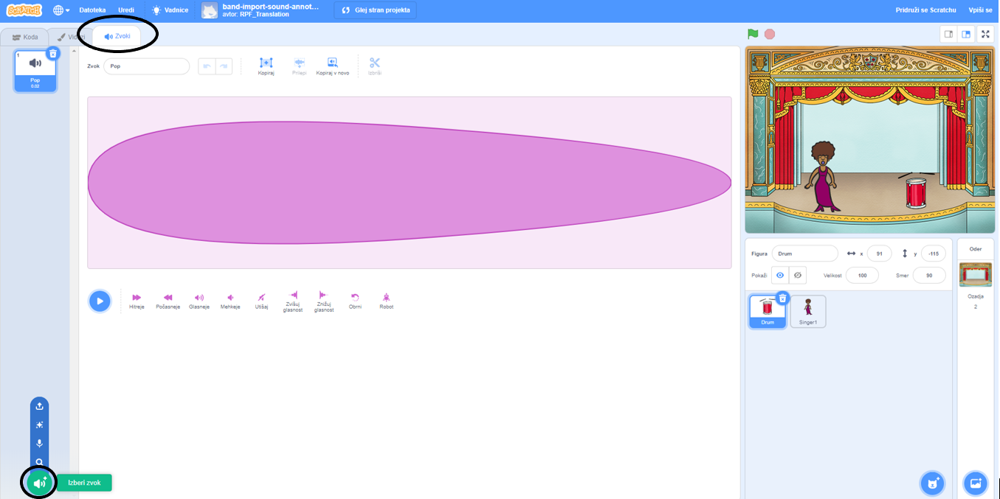
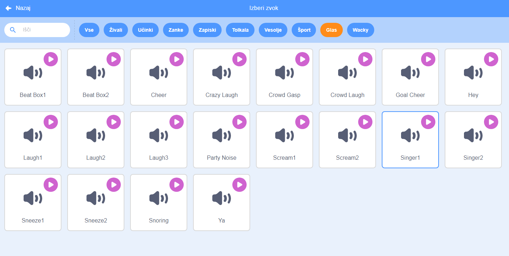

## Ustvarjanje pevke

Sedaj boš v svoj bend dodal pevko!

--- task ---

Na oder dodaj figuro pevke.


[[[generic-scratch3-sprite-from-library]]]

--- /task ---

--- task ---

Preden bo tvoja pevka lahko pela, moraš figuri pevke dodati zvok. Prepričaj se, da si izbral figuro pevke, nato izberi zavihek Zvoki in klikni na **Izberi zvok**:



--- /task ---

--- task ---

Iz seznama na vrhu izberi kategorijo **Glas**, potem pa poišči zvok, ki bi ga rad dodal figuri.



--- /task ---

--- task ---

Da bi ta zvok uporabil, dodaj pevki naslednje bloke kode:

```blocks3
ko kliknemo to figuro
predvajaj zvok (pevec1 v) do konca
```

--- /task ---

--- task ---

Klikni na pevko, ki je na odru in opazuj, kaj se zgodi. Ali poje?

--- /task ---