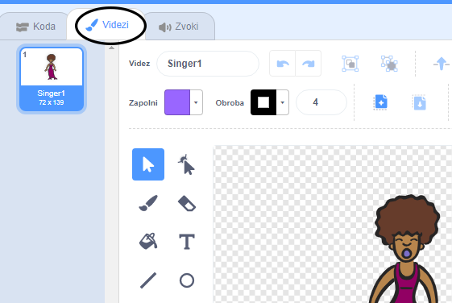
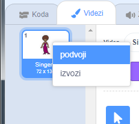
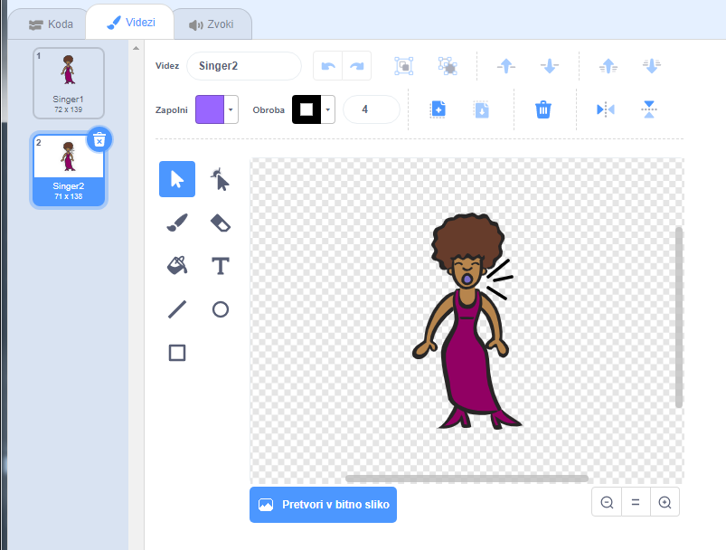
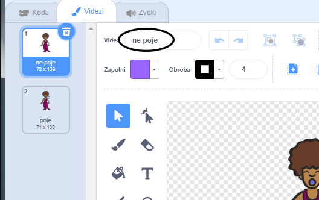

## Videzi

Sedaj boš ustvaril videz, da pevka poje!

\--- task \---

Videz figure pevke lahko spreminjaš z ustvarjanjem novega videza. Klikni na zavihek Videzi in videl boš obstoječe videze pevke.



\--- /task \---

\--- task \---

Klikni na videz z desno tipko miške, nato pa klikni na **podvoji**, da ustvariš kopijo tega videza.



\--- /task \---

\--- task \---

Klikni na ta novi videz (z imenom 'Singer''), nato pa pa izberi orodje za risanje črt in nariši črte, ki bodo ustvarile občutek, da tvoja pevka spušča zvok.



\--- /task \---

\--- task \---

Imena videzov nam v tem trenutku niso v veliko pomoč. Spremeni jih v 'poje' in 'ne poje' tako, da vneseš novo ime v okvirček z imeni videzov.



\--- /task \---

\--- task \---

Sedaj, ko imaš za pevko dva različna videza, lahko izbereš, kateri videz je prikazan! Svoji figuri pevke dodaj še ta dva bloka kode:

```blocks3
ko kliknemo to figuro
+zamenjaj videz na (poje v)
predvajaj zvok (pevka1 v) do konca
+zamenjaj videz na (ne poje v)
```

Blok kode za spreminjanje videza se nahaja v razdelku `Videzi`{: class = "block3looks"}.

\--- /task \---

\--- task \---

Klikni na tvojo pevko na odru. Ali izgleda, kot da poje?

\--- /task \---

\--- task \---

Zdaj pa ustvari videz, kot da nekaj udarja na boben!


- V pomoč so ti lahko navodila za spreminjanje videza figure pevke.

Ne pozabi preveriti ali tvoja koda deluje!

\--- /task \---