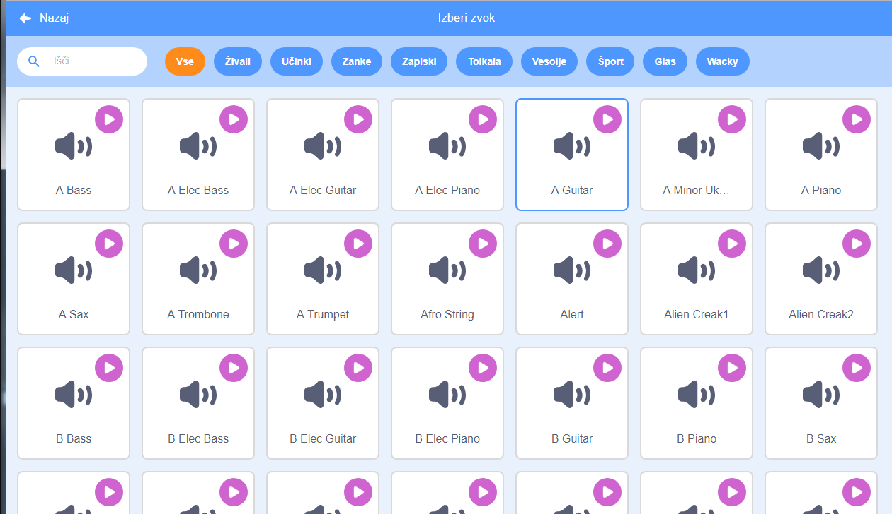
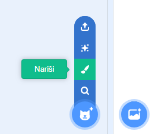
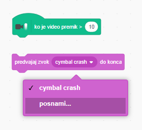

## Izziv: izboljšaj svojo skupino

Uporabi to, kar si se v tem projektu naučil-a, da ustvariš svojo lastno glasbeno skupino! Lahko ustvariš poljubne instrumente - oglej si instrumente in zvoke, ki so že na voljo, da dobiš ideje.



```blocks3
ko kliknemo na to figuro
nastavi inštrument na ( (1 ) Klavir v)
predvajaj noto (60) za (0,25) udarcev
```

Tvoji instrumenti so lahko tudi izmišljeni. Lahko denimo ustvariš klavir iz kolačkov!


Lahko uporabiš več figur iz knjižnice, lahko pa tudi narišeš svoje!



--- collapse ---
---
title: Zakaj moja figura 'skače', ko spremeni videz?
---
Ko ustvariš svojo lastno figuro, boš morda opazil, da ob kliku na figuro ta 'skoči', ko spremeni videz. Razlog je v tem, da videza nista centrirana na istem položaju.

Da bi to popravil, poskrbi, da bosta centra obeh videzov figure enaka.

--- /collapse ---

Če imaš mikrofon, lahko posnameš lastne zvoke, za proženje instrumentov pa lahko uporabiš celo spletno kamero!

