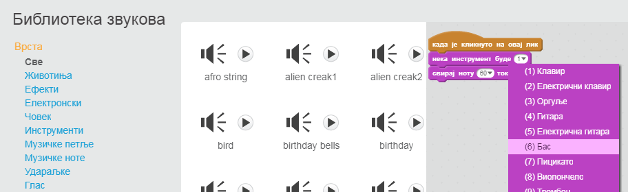
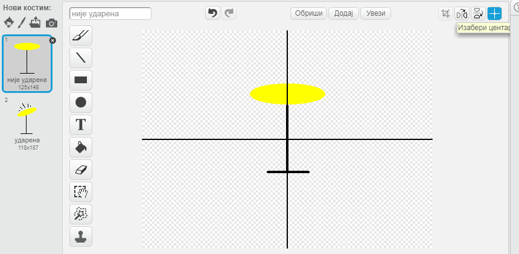

\--- challenge \---

## Изазов: Направи своју групу

Употреби оно што си научио/ла у овом пројекту да би направио сопствену групу! Можеш да направиш било који инструмент који ти се свиђа, погледај које звукове и инструменте имаш на располагању да би добио/ла идеје.

Твоји инструменти не морају да буду правог изгледа. Можеш, на пример, да направиш клавир од мафина!

Као што користиш постојеће ликове, можеш и да нацрташ сопствене.

## \--- collapse \---

## title: Зашто мој лик 'скаче' када промени костим?

+ Када прaвиш свог лика, можеш да приметиш, да када кликнеш на њега, лик 'скаче' док мења костим. То је зато што два костима нису центрирана на истом месту.

Да то поправиш, кликни на **Изабери центар костима** за оба костима, и побрини се да код оба костима центар буде на истом месту.

\--- /collapse \---

Ако имаш микрофон, можеш да снимиш сопствене звукове или чак да користиш веб-камеру да свираш своје инструменте!

\--- /challenge \---