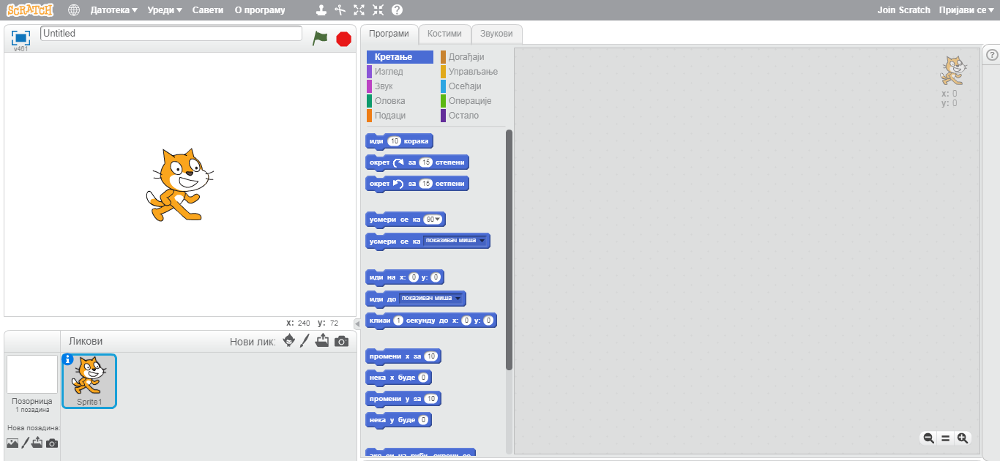
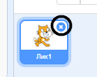
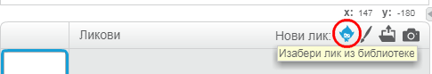
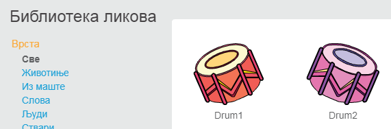
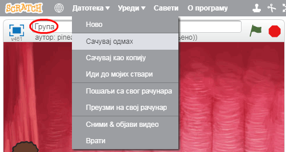

## Ликови

Пре него што почнеш са програмирањем, мораш да додаш оно што ћеш програмирати. У Скречу то се зове **лик**.

\--- task \--- Започни нови Скреч пројекат.

**На мрежи**: започни нови пројекат у Скреч уређивачу на мрежи на [rpf.io/scratchon](http://rpf.io/scratchon){:target="_blank"}.

**Ван мреже:** започни нови пројекат на Скреч уређивачу ван мреже.

Ако је потребно да преузмеш и инсталираш Скреч уређивач ван мреже, можеш га пронаћи на [rpf.io/scratchoff](http://rpf.io/scratchoff){:target="_blank"}.

Он изгледа овако:

 \--- /task \--- \--- task \--- Лик мачке коју видиш је маскота Скреча. Она ти није потребна за ову игру, отараси је се тако што ћеш кликнути десним тастером миша на њу, а затим на **обриши**.

 \--- /task \---

\--- task \--- Затим кликни на **Изабери лик** да би отворио списак свих Скреч ликова.

 \--- /task \---

\--- task \--- Скролуј ка доле док не угледаш лик бубња. Кликни на бубањ да би га додао/ла у пројекат.

\--- /task \---

\--- task \---

Кликни и превуци бубањ на дно Позорнице.

\--- /task \---

\--- task \--- Give your program a name by typing into the text box at the top.

Кликни на **Дадотека**, а затим на **Сачувај одмах** да би сачувао/ла свој пројекат.

If you are not online or don't have a Scratch account, you can save a copy of your project by clicking on **Save to your computer** instead.

 \--- /task \---