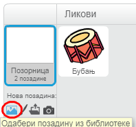
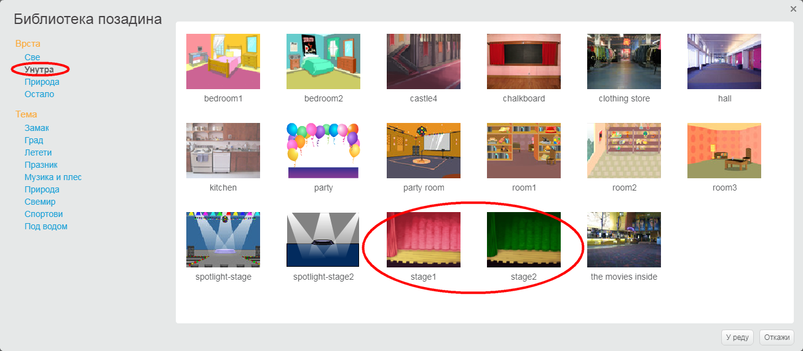

## Позорница

**Позорница** је област са десне стране, тамо где твој пројекат настаје. Замисли је као простор за извођење, баш као права позорница!

\--- task \--- Тренутно је позорница бела и изгледа прилично досадно! Додај позадину тако што ћеш кликнути на **Одабери позадину**.

 \--- /task \---

\--- task \--- Click on **Indoors** in the list at the top. Then click on a theatre backdrop.

 \--- /task \---

\--- task \--- Your stage should now look similar to this:

 \--- /task \---