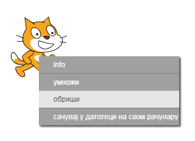
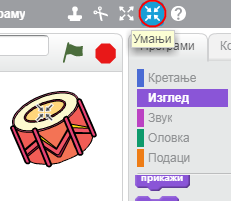

## Ликови

Пре него што почнеш са програмирањем, мораш да додаш оно што ћеш програмирати. У Скречу то се зове **лик**.

+ Прво отвори Скреч уређивач. Скреч уређивач на мрежи можеш пронаћи на <a href="http://jumpto.cc/scratch-new" target="_blank">jumpto.cc/scratch-new</a>. Он изгледа овако:
    
    

+ Мачка коју видиш је маскота Скреча. Отараси је се тако што ћеш притиснути десни тастер миша и изабрати **обриши**.
    
    

+ Затим кликни на **Изабери лик из библиотеке** да би отворио списак свих Скреч ликова.
    
    

+ Скролуј ка доле док не угледаш лик бубња. Кликни на бубањ, а затим на **Уреду** да би га додао/ла у пројекат.
    
    

+ Кликни на икону **Умањи**, а затим неколико пута кликни на бубањ да би га смањио/ла.
    
    

Дај свом програму име, тако што ћеш га уписати у оквир за текст у горњем левом углу.

Кликни на **Дадотека**, а затим на **Сачувај одмах** да би сачувао/ла пројекат. Ако немаш Скреч налог, можеш да сачуваш копију свог пројекта тако што чеш кликнути на **Преузми на свој рачунар**.

