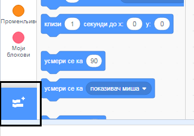
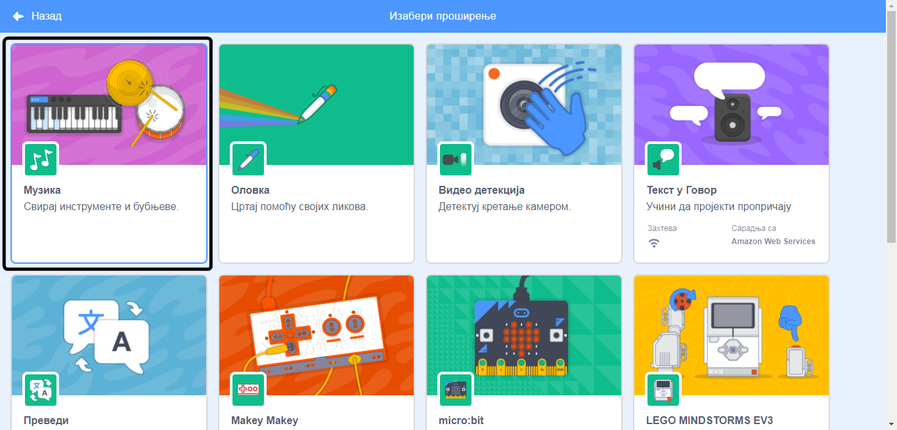
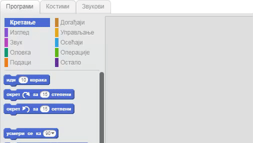

## Направи бубањ

Сада ћеш додати код својем бубњу, тако да бубањ прави звук кад се кликне на њега.

Блокове кода можеш да пронађеш на картици "Програм" и сви су различито обојени!

\--- task \---

Прво додај проширење **Музика**, да би могао/ла да свираш инструменте.

Кликни на дугме **Додај проширење** које се налази у доњем левом углу.



Кликни на проширење **Музика** да би је додао/ла.



\--- /task \---

\--- task \--- Кликни на лик бубња, а затим превуци ова два блока у област за код са десне стране:

\--- no-print \---



\--- /no-print \---

\--- print-only \---

```blocks3
када је кликнуто на овај лик :: events
удараљка ((1) Добош v) током (0.25) откуцаја :: music
```

\--- /print-only \---

Побрини се да су блокови спојени заједно (као LEGO коцкице).

\--- /task \---

\--- task \--- Кликни на бубањ да испробаш свој нови инструмент! \--- /task \---