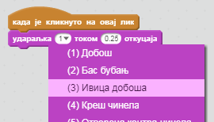
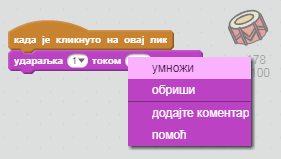

## Изазов: Побољшај бубањ

Можеш ли да промениш звук који бубањ прави када се кликне на њега?



Можеш ли да направиш да бубањ прави звук када се притисне тастер за размак? Мораћеш да употребиш овај блок који се налази у одељку `Догађаји`{:class="block3events"}:

```blocks3
када је дирка [размак v] притиснута :: events
```

Ако хоћеш да копираш свој постојећи код, кликни десним тастером миша на нега, а затим кликнути на **умножи**.

