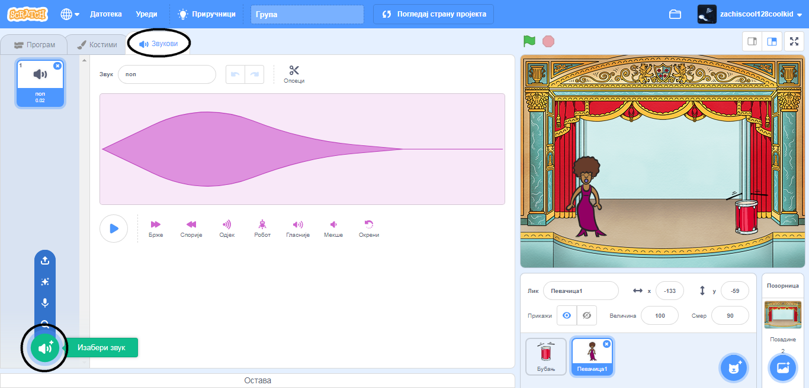
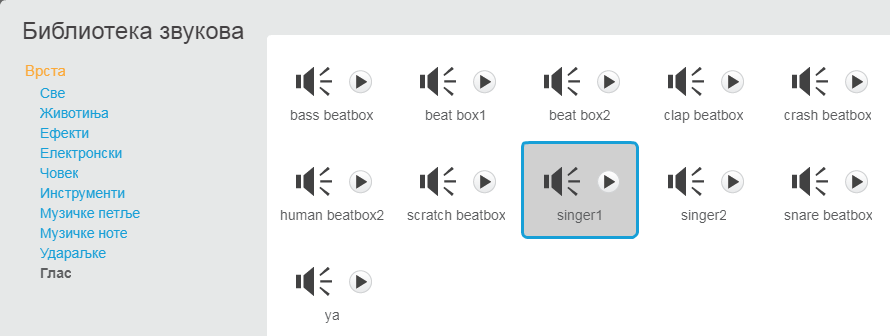

## Направи певачицу

Сада ћеш у твоју групу додати певачицу!

\--- task \---

Додај лик певачице на Позорницу.


[[[generic-scratch3-sprite-from-library]]]

\--- /task \---

\--- task \---

Пре него што направиш да твоја певачица пева, мораш да лику певачице додаш звук. Прво изабери лик певачице, затим кликни на картицу "Звукови" и, на крају кликни **Изабери звук**:

 \--- /task \---

\--- task \--- Click on **Voice** in the list at the top, and then choose a sound to add to your sprite.

 \--- /task \---

\--- task \--- To use the sound, add the following code blocks to your singer sprite:

```blocks3
when this sprite clicked
play sound (singer1 v) until done
```

\--- /task \---

\--- task \--- Кликни на твоју певачицу на позорници и види шта се догађа. Да ли она пева? \--- /task \---