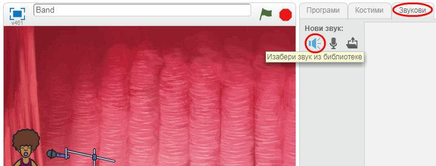

## Направи певачицу

Хајде да твојој групи додамо певачицу!

+ Додај још два лика на своју позорницу: певачицу и микрофон.
    
    

+ Да би твоја певачица запевала, мораш да додаш лику звук. Прво изабери лик певачице, затим кликни на картицу "Звукови" и, на крају кликни **Изабери звук из библиотеке**:
    
    

+ Ако кликнеш на **Глас** са леве стране, моћи ћеш да изабереш одговарајући звук који ћеш додати свом лику.
    
    

+ Сада када је звук додат, можеш да додаш певачици следећи код:
    
    ```blocks
        када је кликнуто на овај лик
    репродукуј звук [певачица v] до краја
    ```

+ Кликни на певачицу да провериш шта се дешава. Да ли она пева?