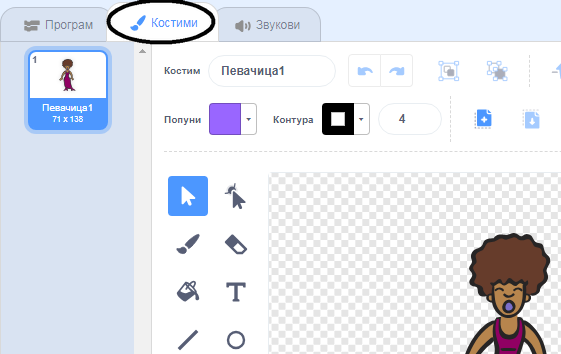
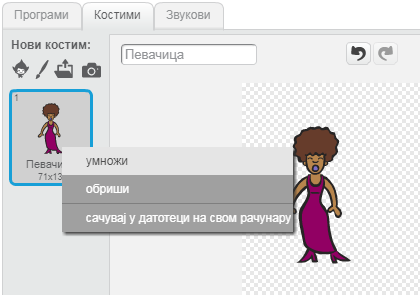
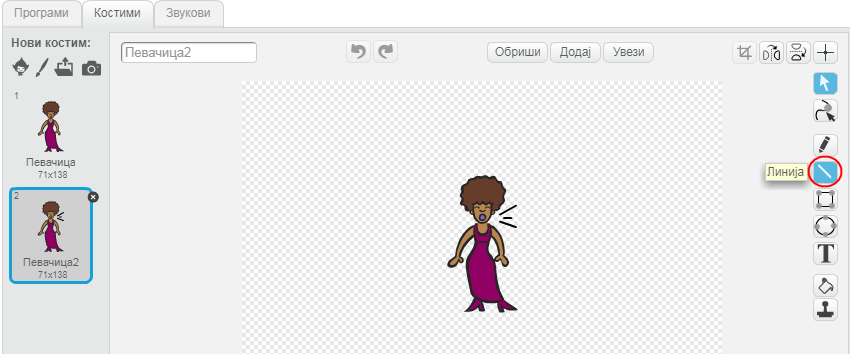
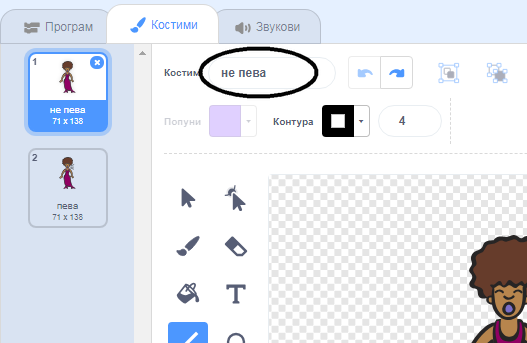

## Костими

Сада ћеш направити да твоја певачица изгледа као да пева!

\--- task \--- Можеш да промениш изглед певачице када се на њу кликне, тако што ћеш направити нови костим. Кликни на картицу 'Костими' и видећеш костим певачице.

 \--- /task \---

\--- task \--- Кликни десним тастером миша на костим, а затим кликни на **умножи** да направиш копију костима.

 \--- /task \---

\--- task \--- Кликни на нови костим ('Певачица2'), а затим изабери алат за цртање линија и нацртај линије тако да изгледа као да певачица пева.

 \--- /task \---

\--- task \--- Имена костима тренутно нису од велике помоћи. Да промениш њихова имена, упиши у оквире за текст 'не пева ' и 'пева'.

 \--- /task \---

\--- task \--- Сада када имаш два различита костима за певачицу, можеш да одабереш који костим ће бити приказан! Додај следећа два блока лику певачице:

```blocks3
када је кликнуто на овај лик :: events
+замени костим са (пева v) :: looks
репродукуј звук (певачица1 v) до краја :: sound
+замени костим са (не пева v) :: looks
```

Блок кода за промену костима налази се у одељку `Изглед`{:class="block3looks"}. \--- /task \---

\--- task \--- Кликни на твоју певачицу на позорници. Да ли изгледа као да пева? \--- /task \---

\--- task \--- Сада направи да твој бубањ изгледа као да је ударен!


- Use the instructions for changing your singer sprite's costume to help you.

Не заборави да испробаш да ли твој нови код ради! \--- /task \---