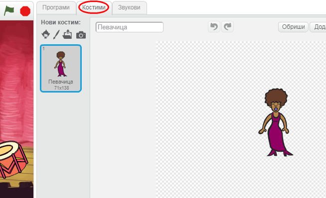
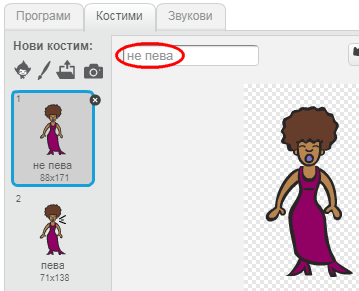

## Костими

Хајде да направимо да твоја певачица изгледа као да пева!

+ Можеш такође да промениш изглед певачице када се на њу кликне, тако што ћеш направити нови костим. Кликни на картицу 'Костими' и видећеш слику певачице.
    
    

+ Кликни десним тастером миша на костим, а затим кликни на **умножи** да направиш копију костима.
    
    

+ Кликни на нови костим ('Певачица2'), а затим изабери алат за цртање линија и нацртај линије тако да изгледа као да певачица пева.
    
    

+ Имена костима тренутно нису од велике помоћи. Преименуј оба костима у 'не пева' и 'пева' тако што ћеш за оба костима уписати ново име у оквир за текст.
    
    

+ Сада када имаш два различита костима за певачицу, можеш да одабереш који костим ће бити приказан! Додај следећа два блока певачици:
    
    
    
    Блок кода за промену костима налази се у одељку `Изглед`{:class="blocklooks"}.

+ Кликни на певачицу. Да ли изгледа као да пева?