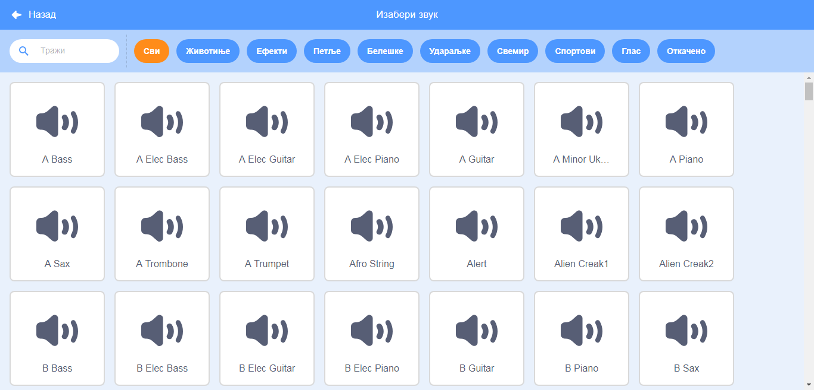
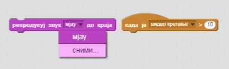

## Изазов: Побољшај групу

Употреби оно што си научио/ла у овом пројекту да би направио/ла сопствену групу! Можеш да направиш било који инструмент који ти се свиђа, погледај које звукове и инструменте имаш на располагању да би добио/ла идеје.



```blocks3
when this sprite clicked
set instrument to (\(1\) Piano v)
play note (60) for (0.25) beats
```

Твоји инструменти не морају да буду правог изгледа. Можеш, на пример, да направиш клавир од мафина!


You can use more sprites from the library, and you can also paint your own sprites!


## \--- collapse \---

## title: Зашто мој лик 'скаче' када промени костим?

When creating your own sprite, you may find that when you click the sprite, it 'jumps' as it changes costume. This is because the two costumes aren't centered in the same place.

To fix this, make sure that the centres of your sprite's costumes are the same.

\--- /collapse \---

If you have a microphone, you can record your own sounds, and you can even use a webcam to hit your instruments!

